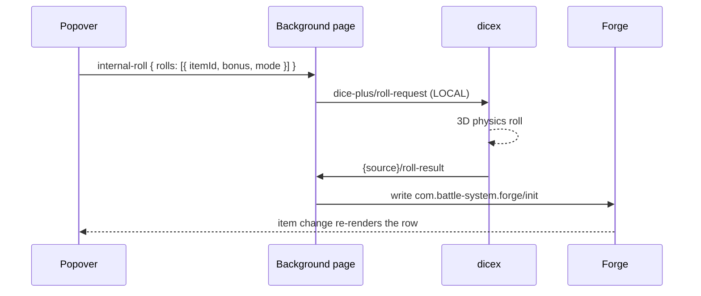

# OBR Forge Helper

An Owlbear Rodeo extension that makes entering initiative in
[Forge](https://extensions.owlbear.rodeo/) painless: every combatant gets a row
with an editable bonus, an advantage toggle, and one Roll button. Rolls run on
real 3D dice through [dicex](https://github.com/abottchen/dicex), and the result
is written straight into Forge's own initiative list. A combatant's own
initiative badge is also editable directly — click it, type a number, and
press Enter to write it straight to Forge without rolling.

## Install

Add this manifest URL as a custom extension in Owlbear Rodeo:

```
https://abottchen.github.io/obr-forge-helper/manifest.json
```

Requires the **dicex** extension (build `68e1254` or later) installed in the
same room.

## How it works



The pipeline lives in a background page rather than the popover because dicex
opens its own tray on every roll, which unmounts whatever panel was showing.
The popover is disposable: close it mid-roll and the result still lands.

## Development

```bash
npm install
npm run dev
```

Then add `http://localhost:5173/manifest.dev.json` as a custom extension.

```bash
npm test          # vitest
npm run build     # tsc + vite build
```

## Known limitations

- A roll totalling zero or less is stored as `1`, because the helper reads `0` as
  "not yet rolled".
