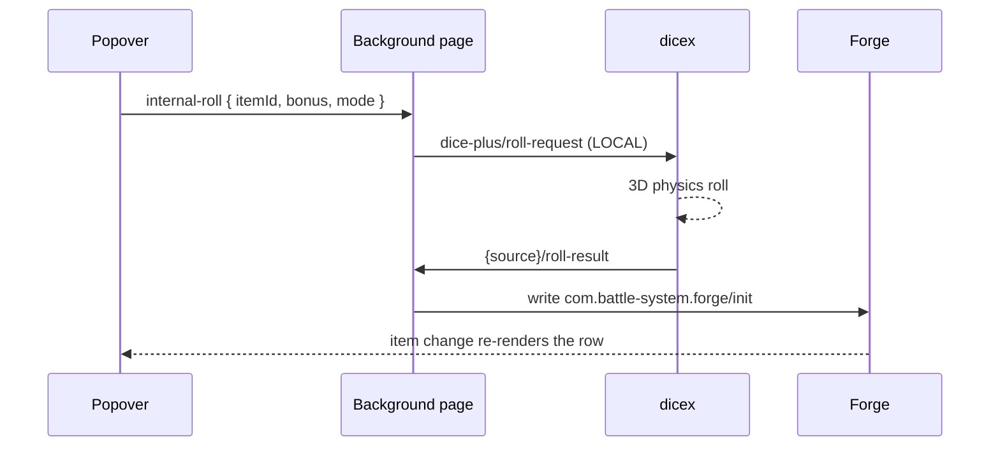

# Forge Helper Implementation Plan

> **For agentic workers:** REQUIRED SUB-SKILL: Use superpowers:subagent-driven-development (recommended) or superpowers:executing-plans to implement this plan task-by-task. Steps use checkbox (`- [ ]`) syntax for tracking.

**Goal:** Build an Owlbear Rodeo extension that lists the current Forge combatants and rolls initiative for them through dicex, writing results back to Forge's own metadata.

**Architecture:** Two contexts. An always-running background page owns the dicex round-trip and the metadata write, because dicex calls `OBR.action.open()` on every roll, which unmounts our popover mid-roll. The action popover renders the roster and fires roll requests at the background over a `LOCAL` broadcast. All roster data is derived from scene items; the only Forge key ever written is `init`.

**Tech Stack:** Vite 6, vanilla TypeScript (strict), `@owlbear-rodeo/sdk` ^3.1.0, Vitest 4 + jsdom. No UI framework. CSS-in-JS injected at boot.

**Spec:** `docs/superpowers/specs/2026-07-18-forge-helper-design.md`

## Global Constraints

- `EXTENSION_ID` MUST be exactly `"com.abottchen.obr-forge-helper"`. dicex's `TRUSTED_ROLL_TARGET_SOURCES` allowlist matches this string exactly; a mismatch silently downgrades every PC roll to hidden with no error.
- Requires dicex `68e1254` or later for visible PC rolls.
- Only `com.battle-system.forge/init` is ever written to Forge, always as a number, always via a metadata merge that preserves the rest of the stat block.
- Initiative writes are clamped with `Math.max(1, total)`.
- Every string interpolated into `innerHTML` goes through `escapeHtml()`.
- All broadcasts use `{ destination: "LOCAL" }`.
- The roll pipeline and the metadata write live in `background.ts`, never in the popover.
- Log with a `[forge-helper]` prefix: `console.warn("[forge-helper] ...", err)`.
- Commit style: `feat:`, `fix:`, `docs:`, `chore:` prefixes.

---

### Task 1: Project scaffold and test harness

**Files:**
- Create: `package.json`, `tsconfig.json`, `vite.config.ts`, `index.html`, `background.html`
- Create: `public/manifest.json`, `public/manifest.dev.json`, `public/icon.svg`
- Create: `test/_mocks/obr-sdk.ts`, `test/smoke.test.ts`

**Interfaces:**
- Consumes: nothing
- Produces: `test/_mocks/obr-sdk.ts` exporting `OBR` and `__testHooks` with `reset()`, `setRole(role)`, `setSelf(id, name)`, `setParty(players)`, `setItems(items)`, `getItem(id)`, `broadcasts`, `store`. It calls `vi.mock("@owlbear-rodeo/sdk", ...)` at module scope, so test files MUST import it before any `src/` module.

- [ ] **Step 1: Create `package.json`**

```json
{
  "name": "obr-forge-helper",
  "private": true,
  "version": "0.1.0",
  "type": "module",
  "scripts": {
    "dev": "vite",
    "build": "tsc && vite build",
    "test": "vitest run",
    "test:watch": "vitest",
    "preview": "vite preview"
  },
  "dependencies": {
    "@owlbear-rodeo/sdk": "^3.1.0"
  },
  "devDependencies": {
    "@types/node": "^20.0.0",
    "jsdom": "^25.0.0",
    "typescript": "~5.8.0",
    "vite": "^6.3.0",
    "vitest": "^4.1.1"
  }
}
```

- [ ] **Step 2: Create `tsconfig.json`**

```json
{
  "compilerOptions": {
    "target": "ES2020",
    "useDefineForClassFields": true,
    "module": "ESNext",
    "lib": ["ES2020", "DOM", "DOM.Iterable"],
    "skipLibCheck": true,
    "moduleResolution": "bundler",
    "allowImportingTsExtensions": true,
    "isolatedModules": true,
    "moduleDetection": "force",
    "noEmit": true,
    "strict": true,
    "noUnusedLocals": true,
    "noUnusedParameters": true,
    "noFallthroughCasesInSwitch": true,
    "outDir": "dist"
  },
  "include": ["src", "test"]
}
```

- [ ] **Step 3: Create `vite.config.ts`**

Two entry points. `base: "./"` so the built assets resolve under the Pages subpath. The CORS origin is what lets OBR's iframe load the dev manifest.

```ts
/// <reference types="vitest" />
import { defineConfig } from "vite";
import { resolve } from "path";

export default defineConfig({
  base: "./",
  build: {
    rollupOptions: {
      input: {
        main: resolve(__dirname, "index.html"),
        background: resolve(__dirname, "background.html"),
      },
    },
  },
  server: { cors: { origin: "https://www.owlbear.rodeo" } },
  test: { globals: true, environment: "jsdom" },
});
```

- [ ] **Step 4: Create `index.html`**

```html
<!doctype html>
<html lang="en">
  <head>
    <meta charset="UTF-8" />
    <meta name="viewport" content="width=device-width, initial-scale=1.0" />
    <title>Forge Helper</title>
  </head>
  <body>
    <div id="root"></div>
    <script type="module" src="/src/main.ts"></script>
  </body>
</html>
```

- [ ] **Step 5: Create `background.html`**

No UI. This page exists only to keep the roll pipeline alive when the popover is unmounted.

```html
<!doctype html>
<html lang="en">
  <head>
    <meta charset="UTF-8" />
    <title>Forge Helper Background</title>
  </head>
  <body>
    <script type="module" src="/src/background.ts"></script>
  </body>
</html>
```

- [ ] **Step 6: Create `public/manifest.json`**

```json
{
  "name": "Forge Helper",
  "description": "Roll initiative for Forge combatants through dicex",
  "version": "0.1.0",
  "manifest_version": 1,
  "author": "abottchen",
  "icon": "https://abottchen.github.io/obr-forge-helper/icon.svg",
  "action": {
    "title": "Forge Helper",
    "icon": "https://abottchen.github.io/obr-forge-helper/icon.svg",
    "popover": "https://abottchen.github.io/obr-forge-helper/index.html",
    "height": 640,
    "width": 400
  },
  "background_url": "https://abottchen.github.io/obr-forge-helper/background.html"
}
```

- [ ] **Step 7: Create `public/manifest.dev.json`**

```json
{
  "name": "Forge Helper (dev)",
  "description": "Roll initiative for Forge combatants through dicex",
  "version": "0.1.0-dev",
  "manifest_version": 1,
  "author": "abottchen",
  "icon": "http://localhost:5173/icon.svg",
  "action": {
    "title": "Forge Helper (dev)",
    "icon": "http://localhost:5173/icon.svg",
    "popover": "http://localhost:5173/index.html",
    "height": 640,
    "width": 400
  },
  "background_url": "http://localhost:5173/background.html"
}
```

- [ ] **Step 8: Create `public/icon.svg`**

`currentColor` stroke so it themes with the OBR sidebar.

```svg
<svg xmlns="http://www.w3.org/2000/svg" viewBox="0 0 32 32" fill="none" stroke="currentColor" stroke-width="2" stroke-linecap="round" stroke-linejoin="round">
  <path d="M16 3 L28 10 L28 22 L16 29 L4 22 L4 10 Z" />
  <path d="M16 3 L16 12" />
  <path d="M4 10 L16 12 L28 10" />
  <path d="M16 12 L9 25" />
  <path d="M16 12 L23 25" />
</svg>
```

- [ ] **Step 9: Create the test mock `test/_mocks/obr-sdk.ts`**

This is the harness every later task depends on. It registers `vi.mock` itself, so test files import it first and get the mock automatically.

```ts
import { vi } from "vitest";

export interface MockItem {
  id: string;
  name: string;
  createdUserId: string;
  layer: string;
  metadata: Record<string, unknown>;
  text?: { plainText?: string };
}

export interface MockPlayer {
  id: string;
  name: string;
  role: "PLAYER" | "GM";
}

const store = new Map<string, unknown>();
const items = new Map<string, MockItem>();
const broadcasts: Array<{ channel: string; data: unknown; destination?: string }> = [];
const broadcastListeners: Record<string, Array<(ev: { data: unknown }) => void>> = {};
const metadataListeners: Array<(m: Record<string, unknown>) => void> = [];
const itemsListeners: Array<(i: MockItem[]) => void> = [];
const partyListeners: Array<(p: MockPlayer[]) => void> = [];

let role: "PLAYER" | "GM" = "PLAYER";
let selfId = "player-self";
let selfName = "Self";
let players: MockPlayer[] = [];
export const notifications: Array<{ message: string; level: string }> = [];

function emitItems(): void {
  const snapshot = [...items.values()];
  itemsListeners.forEach((l) => l(snapshot));
}

export const OBR = {
  isAvailable: true,
  onReady: vi.fn((cb: () => void) => {
    void cb();
  }),
  room: {
    getMetadata: vi.fn(async () => Object.fromEntries(store)),
    setMetadata: vi.fn(async (patch: Record<string, unknown>) => {
      for (const [k, v] of Object.entries(patch)) {
        if (v === undefined) store.delete(k);
        else store.set(k, v);
      }
      const snapshot = Object.fromEntries(store);
      metadataListeners.forEach((l) => l(snapshot));
    }),
    onMetadataChange: vi.fn((cb: (m: Record<string, unknown>) => void) => {
      metadataListeners.push(cb);
      return () => {
        const i = metadataListeners.indexOf(cb);
        if (i >= 0) metadataListeners.splice(i, 1);
      };
    }),
  },
  scene: {
    items: {
      getItems: vi.fn(async () => [...items.values()]),
      updateItems: vi.fn(
        async (ids: string[], mutator: (drafts: MockItem[]) => void) => {
          const drafts = ids
            .map((id) => items.get(id))
            .filter((x): x is MockItem => x !== undefined);
          mutator(drafts);
          emitItems();
        },
      ),
      onChange: vi.fn((cb: (i: MockItem[]) => void) => {
        itemsListeners.push(cb);
        return () => {
          const i = itemsListeners.indexOf(cb);
          if (i >= 0) itemsListeners.splice(i, 1);
        };
      }),
    },
  },
  player: {
    getRole: vi.fn(async () => role),
    getName: vi.fn(async () => selfName),
    get id() {
      return selfId;
    },
  },
  party: {
    getPlayers: vi.fn(async () => players),
    onChange: vi.fn((cb: (p: MockPlayer[]) => void) => {
      partyListeners.push(cb);
      return () => {
        const i = partyListeners.indexOf(cb);
        if (i >= 0) partyListeners.splice(i, 1);
      };
    }),
  },
  broadcast: {
    sendMessage: vi.fn(
      async (channel: string, data: unknown, opts?: { destination?: string }) => {
        broadcasts.push({ channel, data, destination: opts?.destination });
        for (const l of [...(broadcastListeners[channel] ?? [])]) l({ data });
      },
    ),
    onMessage: vi.fn((channel: string, cb: (ev: { data: unknown }) => void) => {
      if (!broadcastListeners[channel]) broadcastListeners[channel] = [];
      broadcastListeners[channel].push(cb);
      return () => {
        const arr = broadcastListeners[channel] ?? [];
        const i = arr.indexOf(cb);
        if (i >= 0) arr.splice(i, 1);
      };
    }),
  },
  notification: {
    show: vi.fn(async (message: string, level: string) => {
      notifications.push({ message, level });
    }),
  },
};

export const __testHooks = {
  reset() {
    store.clear();
    items.clear();
    broadcasts.length = 0;
    notifications.length = 0;
    for (const k of Object.keys(broadcastListeners)) delete broadcastListeners[k];
    metadataListeners.length = 0;
    itemsListeners.length = 0;
    partyListeners.length = 0;
    role = "PLAYER";
    selfId = "player-self";
    selfName = "Self";
    players = [];
  },
  setRole(r: "PLAYER" | "GM") {
    role = r;
  },
  setSelf(id: string, name = "Self") {
    selfId = id;
    selfName = name;
  },
  setParty(p: MockPlayer[]) {
    players = p;
    partyListeners.forEach((l) => l(p));
  },
  setItems(list: MockItem[]) {
    items.clear();
    for (const i of list) items.set(i.id, i);
    emitItems();
  },
  getItem(id: string) {
    return items.get(id);
  },
  broadcasts,
  store,
};

vi.mock("@owlbear-rodeo/sdk", () => ({ default: OBR, OBR }));
```

- [ ] **Step 10: Write the smoke test `test/smoke.test.ts`**

```ts
import { describe, it, expect, beforeEach } from "vitest";
import { OBR, __testHooks } from "./_mocks/obr-sdk";

describe("test harness", () => {
  beforeEach(() => __testHooks.reset());

  it("round-trips room metadata", async () => {
    await OBR.room.setMetadata({ foo: 1 });
    expect(await OBR.room.getMetadata()).toEqual({ foo: 1 });
  });

  it("round-trips scene items", async () => {
    __testHooks.setItems([
      { id: "a", name: "A", createdUserId: "u1", layer: "CHARACTER", metadata: {} },
    ]);
    const items = await OBR.scene.items.getItems();
    expect(items).toHaveLength(1);
    expect(items[0]!.id).toBe("a");
  });
});
```

- [ ] **Step 11: Install and verify**

Run: `npm install && npm test`
Expected: 2 tests pass.

Run: `npm run build`
Expected: `tsc` reports no errors and Vite writes `dist/`. `src/main.ts` and `src/background.ts` do not exist yet, so **this build is expected to fail** with "Could not resolve ./src/main.ts". Create both files as empty placeholders to make the build pass:

```bash
mkdir -p src
echo 'export {};' > src/main.ts
echo 'export {};' > src/background.ts
```

Re-run: `npm run build`
Expected: succeeds, `dist/` written.

- [ ] **Step 12: Commit**

```bash
git add package.json package-lock.json tsconfig.json vite.config.ts index.html background.html public src test
git commit -m "chore: scaffold vite + typescript extension with test harness"
```

---

### Task 2: Constants and types

**Files:**
- Create: `src/constants.ts`, `src/types.ts`
- Test: `test/constants.test.ts`

**Interfaces:**
- Consumes: nothing
- Produces: every constant and type used by later tasks. Exact names below.

- [ ] **Step 1: Write the failing test `test/constants.test.ts`**

The identity test is the guard against the silent dicex allowlist mismatch described in Global Constraints. It is deliberately a literal, not a reference.

```ts
import { describe, it, expect } from "vitest";
import {
  EXTENSION_ID,
  OVERRIDE_KEY_PREFIX,
  ROLL_RESULT_CHANNEL,
  ROLL_ERROR_CHANNEL,
  DICE_PLUS_ROLL_REQUEST_CHANNEL,
  F_ON_LIST,
  F_INIT,
  F_NAME,
  F_DEX,
} from "../src/constants";

describe("constants", () => {
  it("pins EXTENSION_ID to the value on dicex's TRUSTED_ROLL_TARGET_SOURCES allowlist", () => {
    // dicex src/plugin/dicePlusProtocol.ts matches this string exactly.
    // Changing it silently downgrades every PC roll to hidden, with no error.
    expect(EXTENSION_ID).toBe("com.abottchen.obr-forge-helper");
  });

  it("derives response channels from the extension id", () => {
    expect(ROLL_RESULT_CHANNEL).toBe("com.abottchen.obr-forge-helper/roll-result");
    expect(ROLL_ERROR_CHANNEL).toBe("com.abottchen.obr-forge-helper/roll-error");
  });

  it("uses the dice-plus request channel verbatim", () => {
    expect(DICE_PLUS_ROLL_REQUEST_CHANNEL).toBe("dice-plus/roll-request");
  });

  it("namespaces overrides under our own id", () => {
    expect(OVERRIDE_KEY_PREFIX).toBe("com.abottchen.obr-forge-helper/v1/bonus/");
  });

  it("uses Forge's exact metadata keys", () => {
    expect(F_ON_LIST).toBe("com.battle-system.forge/on-list");
    expect(F_INIT).toBe("com.battle-system.forge/init");
    expect(F_NAME).toBe("com.battle-system.forge/name");
    expect(F_DEX).toBe("com.battle-system.forge/Z018");
  });
});
```

- [ ] **Step 2: Run test to verify it fails**

Run: `npx vitest run test/constants.test.ts`
Expected: FAIL, "Failed to resolve import ../src/constants".

- [ ] **Step 3: Create `src/constants.ts`**

```ts
/**
 * Reverse-DNS extension id.
 *
 * This exact string appears in dicex's TRUSTED_ROLL_TARGET_SOURCES
 * (src/plugin/dicePlusProtocol.ts). Only requests whose `source` is on that
 * allowlist may produce a visible roll. Renaming this silently makes every
 * player's initiative roll private, with no error anywhere.
 */
export const EXTENSION_ID = "com.abottchen.obr-forge-helper";

/** Per-token initiative bonus overrides live in room metadata under this prefix. */
export const OVERRIDE_KEY_PREFIX = `${EXTENSION_ID}/v1/bonus/`;

/** Popover -> background: request one or more rolls. */
export const INTERNAL_ROLL_CHANNEL = `${EXTENSION_ID}/internal-roll`;
/** Background -> popover: per-combatant progress, rendered only if the popover is open. */
export const INTERNAL_STATUS_CHANNEL = `${EXTENSION_ID}/internal-status`;

/** dicex echoes our `source` as the prefix of both response channels. */
export const ROLL_RESULT_CHANNEL = `${EXTENSION_ID}/roll-result`;
export const ROLL_ERROR_CHANNEL = `${EXTENSION_ID}/roll-error`;
export const DICE_PLUS_ROLL_REQUEST_CHANNEL = "dice-plus/roll-request";

export const FORGE = "com.battle-system.forge/";
export const F_ON_LIST = `${FORGE}on-list`;
export const F_INIT = `${FORGE}init`;
export const F_NAME = `${FORGE}name`;
/** Dexterity score. String on some tokens, number on others. */
export const F_DEX = `${FORGE}Z018`;

/**
 * dicex runs a 2s handshake and then a full 3D physics animation, so the
 * budget must be generous. It is also the only backstop: a request dicex
 * rejects produces no reply at all.
 */
export const ROLL_TIMEOUT_MS = 20000;
```

- [ ] **Step 4: Create `src/types.ts`**

```ts
export type RollMode = "normal" | "advantage" | "disadvantage";

/** dicex's RollTarget union, copied from its dicePlusProtocol.ts. */
export type RollTarget = "everyone" | "self" | "dm" | "gm_only";

export interface Combatant {
  id: string;
  name: string;
  /** OBR item `createdUserId`. Rewritten when a token is reassigned, so it means "current owner". */
  ownerId: string;
  gmControlled: boolean;
  /** Forge's `init`. 0 means unrolled. */
  init: number;
  /** Raw Z018 value, string or number or absent. Coerced by dexModifier(). */
  dexRaw: unknown;
}

export interface RollSpec {
  itemId: string;
  bonus: number;
  mode: RollMode;
}

/** Popover -> background. A single Roll click sends a one-element array. */
export interface InternalRollMessage {
  rolls: RollSpec[];
}

export interface InternalStatusMessage {
  itemId: string;
  state: "rolling" | "ok" | "error";
  message?: string;
}

export interface DicePlusDie {
  value: number;
  kept: boolean;
}

export interface DicePlusGroup {
  description: string;
  diceType: string;
  dice: DicePlusDie[];
  total: number;
  isNegative: boolean;
}

export interface DicePlusResult {
  totalValue: number;
  rollSummary: string;
  groups: DicePlusGroup[];
}

export interface RollResultMessage {
  rollId: string;
  playerId: string;
  playerName: string;
  rollTarget: RollTarget;
  result: DicePlusResult;
}

export interface RollErrorMessage {
  rollId: string;
  error: string;
  notation: string;
}
```

- [ ] **Step 5: Run test to verify it passes**

Run: `npx vitest run test/constants.test.ts`
Expected: 5 tests PASS.

- [ ] **Step 6: Commit**

```bash
git add src/constants.ts src/types.ts test/constants.test.ts
git commit -m "feat: add extension constants and protocol types"
```

---

### Task 3: Notation builder

**Files:**
- Create: `src/notation.ts`
- Test: `test/notation.test.ts`

**Interfaces:**
- Consumes: `RollMode` from `src/types.ts`
- Produces: `buildNotation(mode: RollMode, bonus: number): string`

- [ ] **Step 1: Write the failing test `test/notation.test.ts`**

```ts
import { describe, it, expect } from "vitest";
import { buildNotation } from "../src/notation";

describe("buildNotation", () => {
  it("builds a plain d20 with no bonus", () => {
    expect(buildNotation("normal", 0)).toBe("1d20");
  });

  it("appends a positive bonus", () => {
    expect(buildNotation("normal", 3)).toBe("1d20+3");
  });

  it("appends a negative bonus with a minus sign", () => {
    expect(buildNotation("normal", -2)).toBe("1d20-2");
  });

  it("uses keep-highest for advantage", () => {
    expect(buildNotation("advantage", 5)).toBe("2d20kh1+5");
  });

  it("uses keep-lowest for disadvantage", () => {
    expect(buildNotation("disadvantage", 0)).toBe("2d20kl1");
  });

  it("handles disadvantage with a negative bonus", () => {
    expect(buildNotation("disadvantage", -1)).toBe("2d20kl1-1");
  });
});
```

- [ ] **Step 2: Run test to verify it fails**

Run: `npx vitest run test/notation.test.ts`
Expected: FAIL, "Failed to resolve import ../src/notation".

- [ ] **Step 3: Create `src/notation.ts`**

dicex's parser rejects a term with no dice, and such a request produces no reply at all — so every notation we emit must contain a die.

```ts
import type { RollMode } from "./types";

/**
 * Build dicex notation for an initiative roll.
 *
 * Advantage and disadvantage are expressed purely in notation; the Dice+
 * protocol has no advantage field. dicex returns both d20 faces, marking the
 * discarded one `kept: false`.
 */
export function buildNotation(mode: RollMode, bonus: number): string {
  const base =
    mode === "advantage"
      ? "2d20kh1"
      : mode === "disadvantage"
        ? "2d20kl1"
        : "1d20";
  if (bonus === 0) return base;
  return bonus > 0 ? `${base}+${bonus}` : `${base}-${Math.abs(bonus)}`;
}
```

- [ ] **Step 4: Run test to verify it passes**

Run: `npx vitest run test/notation.test.ts`
Expected: 6 tests PASS.

- [ ] **Step 5: Commit**

```bash
git add src/notation.ts test/notation.test.ts
git commit -m "feat: build dicex notation from roll mode and bonus"
```

---

### Task 4: Bonus resolution and overrides

**Files:**
- Create: `src/bonus.ts`
- Test: `test/bonus.test.ts`

**Interfaces:**
- Consumes: `OVERRIDE_KEY_PREFIX` from `src/constants.ts`
- Produces:
  - `dexModifier(raw: unknown): number`
  - `overrideKey(itemId: string): string`
  - `itemIdFromOverrideKey(key: string): string`
  - `readOverrides(metadata: Record<string, unknown>): Record<string, number>`
  - `resolveBonus(overrides: Record<string, number>, itemId: string, dexRaw: unknown): number`
  - `writeOverride(itemId: string, bonus: number | null): Promise<void>`
  - `pruneOverrides(liveItemIds: Set<string>): Promise<void>`

- [ ] **Step 1: Write the failing test `test/bonus.test.ts`**

Note the empty-string case: `Number("")` is `0`, not `NaN`, so a naive coercion would return a `-5` modifier for a token with no DEX.

```ts
import { describe, it, expect, beforeEach } from "vitest";
import { OBR, __testHooks } from "./_mocks/obr-sdk";
import {
  dexModifier,
  overrideKey,
  readOverrides,
  resolveBonus,
  writeOverride,
  pruneOverrides,
} from "../src/bonus";

describe("dexModifier", () => {
  it("computes the 5e modifier from a number", () => {
    expect(dexModifier(14)).toBe(2);
  });

  it("computes the modifier from a string, as exported tokens store it", () => {
    expect(dexModifier("12")).toBe(1);
  });

  it("returns 0 for an average score", () => {
    expect(dexModifier(10)).toBe(0);
  });

  it("floors toward negative infinity for odd low scores", () => {
    expect(dexModifier(7)).toBe(-2);
    expect(dexModifier(9)).toBe(-1);
  });

  it("returns 0 when the score is absent", () => {
    expect(dexModifier(undefined)).toBe(0);
    expect(dexModifier(null)).toBe(0);
  });

  it("returns 0 for an empty string rather than treating it as zero", () => {
    expect(dexModifier("")).toBe(0);
    expect(dexModifier("   ")).toBe(0);
  });

  it("returns 0 for a non-numeric score", () => {
    expect(dexModifier("abc")).toBe(0);
  });
});

describe("readOverrides", () => {
  it("extracts only our namespaced keys", () => {
    const md = {
      "com.abottchen.obr-forge-helper/v1/bonus/item-1": 7,
      "com.battle-system.forge/init": 12,
      unrelated: 3,
    };
    expect(readOverrides(md)).toEqual({ "item-1": 7 });
  });

  it("skips null values, which OBR can persist", () => {
    const md = { "com.abottchen.obr-forge-helper/v1/bonus/item-1": null };
    expect(readOverrides(md)).toEqual({});
  });
});

describe("resolveBonus", () => {
  it("prefers an override over the DEX modifier", () => {
    expect(resolveBonus({ "item-1": 7 }, "item-1", 14)).toBe(7);
  });

  it("falls back to the DEX modifier when there is no override", () => {
    expect(resolveBonus({}, "item-1", 14)).toBe(2);
  });

  it("honours an override of zero", () => {
    expect(resolveBonus({ "item-1": 0 }, "item-1", 14)).toBe(0);
  });
});

describe("override persistence", () => {
  beforeEach(() => __testHooks.reset());

  it("writes an override to room metadata", async () => {
    await writeOverride("item-1", 7);
    const md = await OBR.room.getMetadata();
    expect(md[overrideKey("item-1")]).toBe(7);
  });

  it("clears an override when passed null", async () => {
    await writeOverride("item-1", 7);
    await writeOverride("item-1", null);
    const md = await OBR.room.getMetadata();
    expect(overrideKey("item-1") in md).toBe(false);
  });

  it("prunes overrides for items no longer in the scene", async () => {
    await writeOverride("item-1", 7);
    await writeOverride("item-gone", 3);
    await pruneOverrides(new Set(["item-1"]));
    const md = await OBR.room.getMetadata();
    expect(md[overrideKey("item-1")]).toBe(7);
    expect(overrideKey("item-gone") in md).toBe(false);
  });

  it("leaves foreign keys alone when pruning", async () => {
    await OBR.room.setMetadata({ "com.other.ext/thing": 1 });
    await pruneOverrides(new Set());
    const md = await OBR.room.getMetadata();
    expect(md["com.other.ext/thing"]).toBe(1);
  });
});
```

- [ ] **Step 2: Run test to verify it fails**

Run: `npx vitest run test/bonus.test.ts`
Expected: FAIL, "Failed to resolve import ../src/bonus".

- [ ] **Step 3: Create `src/bonus.ts`**

```ts
import OBR from "@owlbear-rodeo/sdk";
import { OVERRIDE_KEY_PREFIX } from "./constants";

/**
 * 5e ability modifier. Hardcoded rather than read from Forge's `initmexp`
 * room setting: it is the only formula Forge ships with, and the override
 * box is the escape hatch for anything it does not capture.
 *
 * Returns 0 for absent or unparseable scores. The empty-string guard matters:
 * Number("") is 0, which would otherwise yield a -5 modifier.
 */
export function dexModifier(raw: unknown): number {
  const s = String(raw ?? "").trim();
  if (s === "") return 0;
  const n = Number(s);
  if (!Number.isFinite(n)) return 0;
  return Math.floor((n - 10) / 2);
}

export function overrideKey(itemId: string): string {
  return `${OVERRIDE_KEY_PREFIX}${itemId}`;
}

export function itemIdFromOverrideKey(key: string): string {
  return key.slice(OVERRIDE_KEY_PREFIX.length);
}

export function readOverrides(
  metadata: Record<string, unknown>,
): Record<string, number> {
  const out: Record<string, number> = {};
  for (const [k, v] of Object.entries(metadata)) {
    if (!k.startsWith(OVERRIDE_KEY_PREFIX) || v == null) continue;
    const n = Number(v);
    if (Number.isFinite(n)) out[itemIdFromOverrideKey(k)] = n;
  }
  return out;
}

export function resolveBonus(
  overrides: Record<string, number>,
  itemId: string,
  dexRaw: unknown,
): number {
  const o = overrides[itemId];
  return o !== undefined ? o : dexModifier(dexRaw);
}

/**
 * One key per token, so concurrent writers never touch the same key and
 * OBR's shallow metadata merge is sufficient. No locking needed.
 */
export async function writeOverride(
  itemId: string,
  bonus: number | null,
): Promise<void> {
  await OBR.room.setMetadata({ [overrideKey(itemId)]: bonus ?? undefined });
}

/** Drop overrides whose token has left the scene. GM-only, run at boot. */
export async function pruneOverrides(liveItemIds: Set<string>): Promise<void> {
  const md = await OBR.room.getMetadata();
  const patch: Record<string, undefined> = {};
  for (const k of Object.keys(md)) {
    if (!k.startsWith(OVERRIDE_KEY_PREFIX)) continue;
    if (!liveItemIds.has(itemIdFromOverrideKey(k))) patch[k] = undefined;
  }
  if (Object.keys(patch).length > 0) await OBR.room.setMetadata(patch);
}
```

- [ ] **Step 4: Run test to verify it passes**

Run: `npx vitest run test/bonus.test.ts`
Expected: 16 tests PASS.

- [ ] **Step 5: Commit**

```bash
git add src/bonus.ts test/bonus.test.ts
git commit -m "feat: resolve initiative bonus from DEX with persisted overrides"
```

---

### Task 5: Session and roster classification

**Files:**
- Create: `src/session.ts`, `src/roster.ts`
- Test: `test/session.test.ts`, `test/roster.test.ts`

**Interfaces:**
- Consumes: `Combatant` from `src/types.ts`
- Produces:
  - `resolveSession(): Promise<Session>` where `interface Session { selfId: string; isGm: boolean; gmId: string | null }`
  - `sortCombatants(list: Combatant[]): Combatant[]`
  - `buildRosterView(all: Combatant[], isGm: boolean): RosterView` where `interface RosterView { pcs: Combatant[]; gms: Combatant[] }`
  - `canRoll(c: Combatant, selfId: string, isGm: boolean): boolean`

- [ ] **Step 1: Write the failing test `test/session.test.ts`**

```ts
import { describe, it, expect, beforeEach } from "vitest";
import { __testHooks } from "./_mocks/obr-sdk";
import { resolveSession } from "../src/session";

describe("resolveSession", () => {
  beforeEach(() => __testHooks.reset());

  it("uses the local player id as the GM id when we are the GM", async () => {
    __testHooks.setRole("GM");
    __testHooks.setSelf("gm-1");
    const s = await resolveSession();
    expect(s).toEqual({ selfId: "gm-1", isGm: true, gmId: "gm-1" });
  });

  it("finds the GM in the party when we are a player", async () => {
    __testHooks.setRole("PLAYER");
    __testHooks.setSelf("p-1");
    __testHooks.setParty([
      { id: "p-1", name: "Simon", role: "PLAYER" },
      { id: "gm-1", name: "Adam", role: "GM" },
    ]);
    const s = await resolveSession();
    expect(s).toEqual({ selfId: "p-1", isGm: false, gmId: "gm-1" });
  });

  it("yields a null gmId when the GM is disconnected", async () => {
    __testHooks.setRole("PLAYER");
    __testHooks.setSelf("p-1");
    __testHooks.setParty([{ id: "p-1", name: "Simon", role: "PLAYER" }]);
    const s = await resolveSession();
    expect(s.gmId).toBeNull();
  });
});
```

- [ ] **Step 2: Run test to verify it fails**

Run: `npx vitest run test/session.test.ts`
Expected: FAIL, "Failed to resolve import ../src/session".

- [ ] **Step 3: Create `src/session.ts`**

```ts
import OBR from "@owlbear-rodeo/sdk";

export interface Session {
  selfId: string;
  isGm: boolean;
  /** null when we are a player and the GM is not connected. */
  gmId: string | null;
}

/**
 * Resolve who we are and who the GM is.
 *
 * getPlayers() returns only *connected* players, which is why ownership is
 * classified by "is the GM" rather than "is a party member": a PC whose owner
 * is offline must still appear for everyone.
 */
export async function resolveSession(): Promise<Session> {
  const role = await OBR.player.getRole();
  const selfId = OBR.player.id;
  if (role === "GM") return { selfId, isGm: true, gmId: selfId };
  const players = await OBR.party.getPlayers();
  const gm = players.find((p) => p.role === "GM");
  return { selfId, isGm: false, gmId: gm ? gm.id : null };
}
```

- [ ] **Step 4: Write the failing test `test/roster.test.ts`**

```ts
import { describe, it, expect } from "vitest";
import { sortCombatants, buildRosterView, canRoll } from "../src/roster";
import type { Combatant } from "../src/types";

function c(over: Partial<Combatant> & { id: string }): Combatant {
  return {
    name: over.id,
    ownerId: "owner",
    gmControlled: false,
    init: 0,
    dexRaw: 10,
    ...over,
  };
}

describe("sortCombatants", () => {
  it("orders by initiative descending", () => {
    const out = sortCombatants([c({ id: "a", init: 5 }), c({ id: "b", init: 17 })]);
    expect(out.map((x) => x.id)).toEqual(["b", "a"]);
  });

  it("puts unrolled combatants last regardless of the others' values", () => {
    const out = sortCombatants([
      c({ id: "unrolled", init: 0 }),
      c({ id: "low", init: 1 }),
      c({ id: "high", init: 20 }),
    ]);
    expect(out.map((x) => x.id)).toEqual(["high", "low", "unrolled"]);
  });

  it("does not mutate its input", () => {
    const input = [c({ id: "a", init: 1 }), c({ id: "b", init: 2 })];
    sortCombatants(input);
    expect(input.map((x) => x.id)).toEqual(["a", "b"]);
  });
});

describe("buildRosterView", () => {
  const all = [
    c({ id: "pc", gmControlled: false, init: 3 }),
    c({ id: "monster", gmControlled: true, init: 9 }),
  ];

  it("gives the GM both blocks", () => {
    const v = buildRosterView(all, true);
    expect(v.pcs.map((x) => x.id)).toEqual(["pc"]);
    expect(v.gms.map((x) => x.id)).toEqual(["monster"]);
  });

  it("hides GM-controlled combatants from players", () => {
    const v = buildRosterView(all, false);
    expect(v.pcs.map((x) => x.id)).toEqual(["pc"]);
    expect(v.gms).toEqual([]);
  });

  it("sorts within each block independently", () => {
    const v = buildRosterView(
      [
        c({ id: "pc-low", gmControlled: false, init: 2 }),
        c({ id: "pc-high", gmControlled: false, init: 18 }),
        c({ id: "gm-mid", gmControlled: true, init: 10 }),
      ],
      true,
    );
    expect(v.pcs.map((x) => x.id)).toEqual(["pc-high", "pc-low"]);
    expect(v.gms.map((x) => x.id)).toEqual(["gm-mid"]);
  });
});

describe("canRoll", () => {
  it("lets the GM roll anything", () => {
    expect(canRoll(c({ id: "x", ownerId: "someone" }), "gm-1", true)).toBe(true);
  });

  it("lets a player roll their own token", () => {
    expect(canRoll(c({ id: "x", ownerId: "p-1" }), "p-1", false)).toBe(true);
  });

  it("stops a player rolling someone else's token", () => {
    expect(canRoll(c({ id: "x", ownerId: "p-2" }), "p-1", false)).toBe(false);
  });
});
```

- [ ] **Step 5: Run test to verify it fails**

Run: `npx vitest run test/roster.test.ts`
Expected: FAIL, "Failed to resolve import ../src/roster".

- [ ] **Step 6: Create `src/roster.ts`**

```ts
import type { Combatant } from "./types";

export interface RosterView {
  pcs: Combatant[];
  gms: Combatant[];
}

/** Initiative descending, with unrolled (init 0) combatants last. */
export function sortCombatants(list: Combatant[]): Combatant[] {
  return [...list].sort((a, b) => {
    const aUnrolled = a.init === 0;
    const bUnrolled = b.init === 0;
    if (aUnrolled !== bUnrolled) return aUnrolled ? 1 : -1;
    return b.init - a.init;
  });
}

/**
 * Split into the shared PC block and the GM-only block. Sorting is applied
 * within each block, never across them, so the divider stays meaningful.
 */
export function buildRosterView(all: Combatant[], isGm: boolean): RosterView {
  return {
    pcs: sortCombatants(all.filter((c) => !c.gmControlled)),
    gms: isGm ? sortCombatants(all.filter((c) => c.gmControlled)) : [],
  };
}

/**
 * Players roll only tokens they own, which keeps every write inside
 * CHARACTER_OWNER_ONLY. The GM rolls anything, covering absent players.
 */
export function canRoll(c: Combatant, selfId: string, isGm: boolean): boolean {
  return isGm || c.ownerId === selfId;
}
```

- [ ] **Step 7: Run tests to verify they pass**

Run: `npx vitest run test/session.test.ts test/roster.test.ts`
Expected: 12 tests PASS.

- [ ] **Step 8: Commit**

```bash
git add src/session.ts src/roster.ts test/session.test.ts test/roster.test.ts
git commit -m "feat: classify combatants by ownership and split roster by role"
```

---

### Task 6: Forge roster read and initiative write

**Files:**
- Create: `src/forge.ts`
- Test: `test/forge.test.ts`

**Interfaces:**
- Consumes: `F_ON_LIST`, `F_INIT`, `F_NAME`, `F_DEX` from `src/constants.ts`; `Combatant` from `src/types.ts`
- Produces:
  - `combatantName(item: ForgeItem): string`
  - `toCombatant(item: ForgeItem, gmId: string | null): Combatant`
  - `readRoster(gmId: string | null): Promise<Combatant[]>`
  - `writeInit(itemId: string, total: number): Promise<void>`
  - `type ForgeItem = { id: string; name: string; createdUserId: string; metadata: Record<string, unknown>; text?: { plainText?: string } }`

- [ ] **Step 1: Write the failing test `test/forge.test.ts`**

```ts
import { describe, it, expect, beforeEach } from "vitest";
import { OBR, __testHooks } from "./_mocks/obr-sdk";
import { combatantName, readRoster, writeInit } from "../src/forge";
import { F_ON_LIST, F_INIT, F_NAME, F_DEX } from "../src/constants";

function token(over: {
  id: string;
  owner?: string;
  onList?: boolean;
  init?: number;
  forgeName?: string;
  plainText?: string;
  dex?: unknown;
  itemName?: string;
}) {
  const metadata: Record<string, unknown> = {};
  if (over.onList !== undefined) metadata[F_ON_LIST] = over.onList;
  if (over.init !== undefined) metadata[F_INIT] = over.init;
  if (over.forgeName !== undefined) metadata[F_NAME] = over.forgeName;
  if (over.dex !== undefined) metadata[F_DEX] = over.dex;
  return {
    id: over.id,
    name: over.itemName ?? "item-name",
    createdUserId: over.owner ?? "owner",
    layer: "CHARACTER",
    metadata,
    text: { plainText: over.plainText ?? "" },
  };
}

describe("combatantName", () => {
  it("prefers the Forge name", () => {
    expect(
      combatantName(token({ id: "a", forgeName: "Goblin", plainText: "Robust Goblin" })),
    ).toBe("Goblin");
  });

  it("falls back to the board label when Forge has no name", () => {
    expect(combatantName(token({ id: "a", plainText: "Robust Goblin" }))).toBe(
      "Robust Goblin",
    );
  });

  it("falls back to the item name when both are absent", () => {
    expect(combatantName(token({ id: "a", itemName: "Untitled" }))).toBe("Untitled");
  });
});

describe("readRoster", () => {
  beforeEach(() => __testHooks.reset());

  it("includes only tokens on Forge's initiative list", async () => {
    __testHooks.setItems([
      token({ id: "on", onList: true }),
      token({ id: "off", onList: false }),
      token({ id: "absent" }),
    ]);
    const roster = await readRoster(null);
    expect(roster.map((c) => c.id)).toEqual(["on"]);
  });

  it("marks tokens owned by the GM as GM-controlled", async () => {
    __testHooks.setItems([
      token({ id: "monster", onList: true, owner: "gm-1" }),
      token({ id: "pc", onList: true, owner: "p-1" }),
    ]);
    const roster = await readRoster("gm-1");
    expect(roster.find((c) => c.id === "monster")!.gmControlled).toBe(true);
    expect(roster.find((c) => c.id === "pc")!.gmControlled).toBe(false);
  });

  it("treats every token as PC-controlled when the GM id is unknown", async () => {
    __testHooks.setItems([token({ id: "monster", onList: true, owner: "gm-1" })]);
    const roster = await readRoster(null);
    expect(roster[0]!.gmControlled).toBe(false);
  });

  it("defaults a missing init to 0", async () => {
    __testHooks.setItems([token({ id: "a", onList: true })]);
    expect((await readRoster(null))[0]!.init).toBe(0);
  });

  it("carries the raw DEX value through unconverted", async () => {
    __testHooks.setItems([token({ id: "a", onList: true, dex: "12" })]);
    expect((await readRoster(null))[0]!.dexRaw).toBe("12");
  });
});

describe("writeInit", () => {
  beforeEach(() => __testHooks.reset());

  it("writes the rolled total", async () => {
    __testHooks.setItems([token({ id: "a", onList: true })]);
    await writeInit("a", 17);
    expect(__testHooks.getItem("a")!.metadata[F_INIT]).toBe(17);
  });

  it("clamps zero to 1 so the combatant does not read as unrolled", async () => {
    __testHooks.setItems([token({ id: "a", onList: true })]);
    await writeInit("a", 0);
    expect(__testHooks.getItem("a")!.metadata[F_INIT]).toBe(1);
  });

  it("clamps a negative total to 1", async () => {
    __testHooks.setItems([token({ id: "a", onList: true })]);
    await writeInit("a", -3);
    expect(__testHooks.getItem("a")!.metadata[F_INIT]).toBe(1);
  });

  it("preserves the rest of the stat block", async () => {
    __testHooks.setItems([
      token({ id: "a", onList: true, forgeName: "Goblin", dex: "14" }),
    ]);
    await writeInit("a", 12);
    const md = __testHooks.getItem("a")!.metadata;
    expect(md[F_NAME]).toBe("Goblin");
    expect(md[F_DEX]).toBe("14");
    expect(md[F_ON_LIST]).toBe(true);
    expect(md[F_INIT]).toBe(12);
  });

  it("targets only the named item", async () => {
    __testHooks.setItems([
      token({ id: "a", onList: true }),
      token({ id: "b", onList: true, init: 5 }),
    ]);
    await writeInit("a", 12);
    expect(__testHooks.getItem("b")!.metadata[F_INIT]).toBe(5);
    expect(OBR.scene.items.updateItems).toHaveBeenCalledWith(["a"], expect.any(Function));
  });
});
```

- [ ] **Step 2: Run test to verify it fails**

Run: `npx vitest run test/forge.test.ts`
Expected: FAIL, "Failed to resolve import ../src/forge".

- [ ] **Step 3: Create `src/forge.ts`**

The SDK's `Item` is a union and only some members carry `text`, so the module declares its own structural type rather than fighting the union.

```ts
import OBR from "@owlbear-rodeo/sdk";
import { F_ON_LIST, F_INIT, F_NAME, F_DEX } from "./constants";
import type { Combatant } from "./types";

/** The structural subset of an OBR item this module needs. */
export interface ForgeItem {
  id: string;
  name: string;
  createdUserId: string;
  metadata: Record<string, unknown>;
  text?: { plainText?: string };
}

function isOnList(item: ForgeItem): boolean {
  return item.metadata[F_ON_LIST] === true;
}

/**
 * Forge name, then the on-board label, then the item name. Many tokens share
 * one stat block name but carry distinct board labels ("Robust Goblin"), so
 * the fallback order matters for telling duplicates apart.
 */
export function combatantName(item: ForgeItem): string {
  const forgeName = item.metadata[F_NAME];
  if (typeof forgeName === "string" && forgeName.trim() !== "") return forgeName;
  const plain = item.text?.plainText;
  if (typeof plain === "string" && plain.trim() !== "") return plain;
  return item.name;
}

export function toCombatant(item: ForgeItem, gmId: string | null): Combatant {
  const rawInit = item.metadata[F_INIT];
  return {
    id: item.id,
    name: combatantName(item),
    ownerId: item.createdUserId,
    gmControlled: gmId !== null && item.createdUserId === gmId,
    init: typeof rawInit === "number" ? rawInit : 0,
    dexRaw: item.metadata[F_DEX],
  };
}

/**
 * Forge stores no encounter object. The roster is every scene item flagged
 * `on-list`, so it is derived fresh on every read.
 */
export async function readRoster(gmId: string | null): Promise<Combatant[]> {
  const items = (await OBR.scene.items.getItems()) as unknown as ForgeItem[];
  return items.filter(isOnList).map((i) => toCombatant(i, gmId));
}

/**
 * The only Forge key we ever write. Clamped to 1 because Forge reads 0 as
 * "unrolled": a natural 1 with a negative modifier would otherwise be swept
 * into the next bulk roll and overwrite itself. dicex has already logged the
 * true total by this point, so the roll record stays honest.
 */
export async function writeInit(itemId: string, total: number): Promise<void> {
  const value = Math.max(1, total);
  await OBR.scene.items.updateItems([itemId], (drafts: ForgeItem[]) => {
    for (const d of drafts) d.metadata[F_INIT] = value;
  });
}
```

- [ ] **Step 4: Run test to verify it passes**

Run: `npx vitest run test/forge.test.ts`
Expected: 13 tests PASS.

- [ ] **Step 5: Commit**

```bash
git add src/forge.ts test/forge.test.ts
git commit -m "feat: read Forge roster from scene items and write clamped initiative"
```

---

### Task 7: dicex client

**Files:**
- Create: `src/dicePlus.ts`
- Modify: `test/_mocks/obr-sdk.ts` (add a scriptable fake dicex)
- Test: `test/dicePlus.test.ts`

**Interfaces:**
- Consumes: channel constants and `ROLL_TIMEOUT_MS` from `src/constants.ts`; `RollTarget`, `DicePlusResult` from `src/types.ts`
- Produces:
  - `rollViaDicePlus(notation: string, rollTarget: RollTarget): Promise<DicePlusResult>`
  - `__dicePlusTestHooks.reset(): void`
- Also produces in the mock: `__testHooks.fakeDicex(behaviour)` where `behaviour` is `{ mode: "reply"; total: number } | { mode: "error"; message: string } | { mode: "silent" } | { mode: "foreignId" }`

- [ ] **Step 1: Add the fake dicex to `test/_mocks/obr-sdk.ts`**

Append to the file, after the `__testHooks` export. It listens on the request channel and replies the way a real dicex would.

```ts
export type DicexBehaviour =
  | { mode: "reply"; total: number }
  | { mode: "error"; message: string }
  | { mode: "silent" }
  | { mode: "foreignId" };

/**
 * Stand-in for dicex. Mirrors the parts of the contract that matter:
 * it replies on `{source}/roll-result`, echoes the rollId, and honours
 * the playerId gate by ignoring requests addressed elsewhere.
 */
export function fakeDicex(behaviour: DicexBehaviour): () => void {
  return OBR.broadcast.onMessage("dice-plus/roll-request", (ev) => {
    const req = ev.data as {
      rollId: string;
      playerId: string;
      source: string;
      diceNotation: string;
    };
    if (req.playerId !== selfId) return;
    if (behaviour.mode === "silent") return;
    if (behaviour.mode === "error") {
      void OBR.broadcast.sendMessage(
        `${req.source}/roll-error`,
        { rollId: req.rollId, error: behaviour.message, notation: req.diceNotation },
        { destination: "LOCAL" },
      );
      return;
    }
    const rollId = behaviour.mode === "foreignId" ? "some-other-roll" : req.rollId;
    const total = behaviour.mode === "reply" ? behaviour.total : 0;
    void OBR.broadcast.sendMessage(
      `${req.source}/roll-result`,
      {
        rollId,
        playerId: req.playerId,
        playerName: selfName,
        rollTarget: "everyone",
        result: {
          totalValue: total,
          rollSummary: `${total}`,
          groups: [
            {
              description: req.diceNotation,
              diceType: "d20",
              dice: [{ value: total, kept: true }],
              total,
              isNegative: false,
            },
          ],
        },
      },
      { destination: "LOCAL" },
    );
  });
}
```

- [ ] **Step 2: Write the failing test `test/dicePlus.test.ts`**

```ts
import { describe, it, expect, beforeEach, afterEach, vi } from "vitest";
import { OBR, __testHooks, fakeDicex } from "./_mocks/obr-sdk";
import { rollViaDicePlus, __dicePlusTestHooks } from "../src/dicePlus";
import { EXTENSION_ID, DICE_PLUS_ROLL_REQUEST_CHANNEL } from "../src/constants";

describe("rollViaDicePlus", () => {
  beforeEach(() => {
    __testHooks.reset();
    __dicePlusTestHooks.reset();
  });
  afterEach(() => vi.useRealTimers());

  it("resolves with the dicex result", async () => {
    fakeDicex({ mode: "reply", total: 17 });
    const result = await rollViaDicePlus("1d20+3", "everyone");
    expect(result.totalValue).toBe(17);
  });

  it("sends a well-formed request addressed to the local player", async () => {
    fakeDicex({ mode: "reply", total: 5 });
    await rollViaDicePlus("1d20", "gm_only");
    const req = __testHooks.broadcasts.find(
      (b) => b.channel === DICE_PLUS_ROLL_REQUEST_CHANNEL,
    )!;
    const data = req.data as Record<string, unknown>;
    expect(req.destination).toBe("LOCAL");
    expect(data.source).toBe(EXTENSION_ID);
    expect(data.playerId).toBe("player-self");
    expect(data.rollTarget).toBe("gm_only");
    expect(data.diceNotation).toBe("1d20");
    expect(typeof data.rollId).toBe("string");
  });

  it("rejects with the dicex error message", async () => {
    fakeDicex({ mode: "error", message: "Invalid die type: d3" });
    await expect(rollViaDicePlus("1d3", "everyone")).rejects.toThrow(
      "Invalid die type: d3",
    );
  });

  it("ignores a result carrying someone else's rollId", async () => {
    vi.useFakeTimers();
    fakeDicex({ mode: "foreignId" });
    const p = rollViaDicePlus("1d20", "everyone");
    const assertion = expect(p).rejects.toThrow(/did not respond/);
    await vi.advanceTimersByTimeAsync(20000);
    await assertion;
  });

  it("times out when dicex never replies", async () => {
    vi.useFakeTimers();
    fakeDicex({ mode: "silent" });
    const p = rollViaDicePlus("1d20", "everyone");
    const assertion = expect(p).rejects.toThrow(/did not respond/);
    await vi.advanceTimersByTimeAsync(20000);
    await assertion;
  });

  it("serializes concurrent rolls so dicex never sees two at once", async () => {
    // Reply on a later tick, so an unserialized implementation would overlap.
    // Asserting on broadcast counts immediately after the calls would not work:
    // rollViaDicePlus schedules its work on the promise chain, so nothing has
    // been sent yet at that point.
    let inFlight = 0;
    let maxConcurrent = 0;
    const seen: string[] = [];
    OBR.broadcast.onMessage(DICE_PLUS_ROLL_REQUEST_CHANNEL, (ev) => {
      const req = ev.data as {
        rollId: string;
        source: string;
        diceNotation: string;
      };
      inFlight += 1;
      maxConcurrent = Math.max(maxConcurrent, inFlight);
      seen.push(req.diceNotation);
      setTimeout(() => {
        inFlight -= 1;
        void OBR.broadcast.sendMessage(
          `${req.source}/roll-result`,
          {
            rollId: req.rollId,
            playerId: "player-self",
            playerName: "Self",
            rollTarget: "everyone",
            result: { totalValue: 7, rollSummary: "7", groups: [] },
          },
          { destination: "LOCAL" },
        );
      }, 0);
    });

    await Promise.all([
      rollViaDicePlus("1d20", "everyone"),
      rollViaDicePlus("1d20+1", "everyone"),
    ]);

    expect(seen).toEqual(["1d20", "1d20+1"]);
    expect(maxConcurrent).toBe(1);
  });

  it("keeps the queue alive after a rejection", async () => {
    const stop = fakeDicex({ mode: "error", message: "boom" });
    await expect(rollViaDicePlus("1d20", "everyone")).rejects.toThrow("boom");
    stop();
    fakeDicex({ mode: "reply", total: 11 });
    await expect(rollViaDicePlus("1d20", "everyone")).resolves.toMatchObject({
      totalValue: 11,
    });
  });
});
```

- [ ] **Step 3: Run test to verify it fails**

Run: `npx vitest run test/dicePlus.test.ts`
Expected: FAIL, "Failed to resolve import ../src/dicePlus".

- [ ] **Step 4: Create `src/dicePlus.ts`**

```ts
import OBR from "@owlbear-rodeo/sdk";
import {
  DICE_PLUS_ROLL_REQUEST_CHANNEL,
  ROLL_RESULT_CHANNEL,
  ROLL_ERROR_CHANNEL,
  EXTENSION_ID,
  ROLL_TIMEOUT_MS,
} from "./constants";
import type {
  RollTarget,
  RollRequest,
  DicePlusResult,
  RollResultMessage,
  RollErrorMessage,
} from "./types";

/**
 * dicex tracks a single pending Dice+ request in a module global, so a second
 * roll overwrites the first's routing and the first requester never hears
 * back. Serialize through a promise chain.
 *
 * Scope is per client: our request is LOCAL and dicex ignores requests not
 * addressed to the local player, so two players rolling simultaneously never
 * touch the same state. This queue exists only for same-client concurrency —
 * the GM rolling several monsters, or a player who owns two tokens.
 */
let queue: Promise<unknown> = Promise.resolve();

export function rollViaDicePlus(
  notation: string,
  rollTarget: RollTarget,
): Promise<DicePlusResult> {
  const run = () => rollOnce(notation, rollTarget);
  const next = queue.then(run, run);
  queue = next.then(
    () => undefined,
    () => undefined,
  );
  return next;
}

function rollOnce(
  notation: string,
  rollTarget: RollTarget,
): Promise<DicePlusResult> {
  return new Promise<DicePlusResult>((resolve, reject) => {
    const rollId = crypto.randomUUID();
    const teardowns: Array<() => void> = [];
    let settled = false;

    const finish = (fn: () => void): void => {
      if (settled) return;
      settled = true;
      for (const t of teardowns) t();
      fn();
    };

    // dicex clears its pending slot only on success, so a stale request can
    // attach to the user's next manual tray roll and deliver that result
    // here. Never trust a result whose rollId is not ours.
    teardowns.push(
      OBR.broadcast.onMessage(ROLL_RESULT_CHANNEL, (event) => {
        const data = event.data as RollResultMessage;
        if (data?.rollId !== rollId) return;
        finish(() => resolve(data.result));
      }),
    );

    teardowns.push(
      OBR.broadcast.onMessage(ROLL_ERROR_CHANNEL, (event) => {
        const data = event.data as RollErrorMessage;
        if (data?.rollId !== rollId) return;
        finish(() => reject(new Error(data.error)));
      }),
    );

    // A malformed request, or one addressed to another player, is dropped
    // silently. This timeout is the only backstop.
    const timer = setTimeout(() => {
      finish(() =>
        reject(
          new Error(
            "dicex did not respond (is the dicex extension installed and this tab active?)",
          ),
        ),
      );
    }, ROLL_TIMEOUT_MS);
    teardowns.push(() => clearTimeout(timer));

    void (async () => {
      try {
        const playerName = await OBR.player.getName();
        // Typed, so a missing or misnamed field is a compile error. dicex
        // validates with isRollRequest() and silently drops anything that
        // fails — no error comes back, only a 20s timeout.
        const payload: RollRequest = {
          rollId,
          // dicex drops the request unless this is the local player.
          playerId: OBR.player.id,
          playerName,
          rollTarget,
          diceNotation: notation,
          showResults: true,
          timestamp: Date.now(),
          // Echoed back as the response channel prefix, and matched against
          // dicex's TRUSTED_ROLL_TARGET_SOURCES to decide visibility.
          source: EXTENSION_ID,
        };
        await OBR.broadcast.sendMessage(DICE_PLUS_ROLL_REQUEST_CHANNEL, payload, {
          destination: "LOCAL",
        });
      } catch (e) {
        finish(() => reject(e instanceof Error ? e : new Error(String(e))));
      }
    })();
  });
}

export const __dicePlusTestHooks = {
  reset(): void {
    queue = Promise.resolve();
  },
};
```

- [ ] **Step 5: Run test to verify it passes**

Run: `npx vitest run test/dicePlus.test.ts`
Expected: 7 tests PASS.

- [ ] **Step 6: Commit**

```bash
git add src/dicePlus.ts test/dicePlus.test.ts test/_mocks/obr-sdk.ts
git commit -m "feat: add dicex Dice+ client with correlation, timeout and serialization"
```

---

### Task 8: Background roll pipeline

**Files:**
- Create: `src/background.ts`
- Test: `test/background.test.ts`

**Interfaces:**
- Consumes: `rollViaDicePlus`, `readRoster`, `writeInit`, `resolveSession`, `buildNotation`, channel constants, `InternalRollMessage`, `InternalStatusMessage`
- Produces:
  - `handleRolls(specs: RollSpec[]): Promise<void>` (exported for testing)
  - `startBackground(): void` — registers the `internal-roll` listener

- [ ] **Step 1: Write the failing test `test/background.test.ts`**

```ts
import { describe, it, expect, beforeEach } from "vitest";
import { OBR, __testHooks, fakeDicex, notifications } from "./_mocks/obr-sdk";
import { handleRolls } from "../src/background";
import { __dicePlusTestHooks } from "../src/dicePlus";
import {
  F_ON_LIST,
  F_INIT,
  F_NAME,
  F_DEX,
  INTERNAL_STATUS_CHANNEL,
  DICE_PLUS_ROLL_REQUEST_CHANNEL,
} from "../src/constants";

function token(id: string, owner: string, dex = "14") {
  return {
    id,
    name: id,
    createdUserId: owner,
    layer: "CHARACTER",
    metadata: { [F_ON_LIST]: true, [F_INIT]: 0, [F_NAME]: id, [F_DEX]: dex },
    text: { plainText: "" },
  };
}

describe("handleRolls", () => {
  beforeEach(() => {
    __testHooks.reset();
    __dicePlusTestHooks.reset();
    __testHooks.setRole("GM");
    __testHooks.setSelf("gm-1", "Adam");
  });

  it("writes the rolled initiative to Forge", async () => {
    __testHooks.setItems([token("goblin", "gm-1")]);
    fakeDicex({ mode: "reply", total: 14 });
    await handleRolls([{ itemId: "goblin", bonus: 2, mode: "normal" }]);
    expect(__testHooks.getItem("goblin")!.metadata[F_INIT]).toBe(14);
  });

  it("sends gm_only for a GM-controlled token", async () => {
    __testHooks.setItems([token("goblin", "gm-1")]);
    fakeDicex({ mode: "reply", total: 9 });
    await handleRolls([{ itemId: "goblin", bonus: 0, mode: "normal" }]);
    const req = __testHooks.broadcasts.find(
      (b) => b.channel === DICE_PLUS_ROLL_REQUEST_CHANNEL,
    )!;
    expect((req.data as Record<string, unknown>).rollTarget).toBe("gm_only");
  });

  it("sends everyone for a PC token, even when the GM rolls it", async () => {
    __testHooks.setItems([token("vex", "p-1")]);
    fakeDicex({ mode: "reply", total: 9 });
    await handleRolls([{ itemId: "vex", bonus: 0, mode: "normal" }]);
    const req = __testHooks.broadcasts.find(
      (b) => b.channel === DICE_PLUS_ROLL_REQUEST_CHANNEL,
    )!;
    expect((req.data as Record<string, unknown>).rollTarget).toBe("everyone");
  });

  it("builds notation from the requested mode and bonus", async () => {
    __testHooks.setItems([token("goblin", "gm-1")]);
    fakeDicex({ mode: "reply", total: 9 });
    await handleRolls([{ itemId: "goblin", bonus: 3, mode: "advantage" }]);
    const req = __testHooks.broadcasts.find(
      (b) => b.channel === DICE_PLUS_ROLL_REQUEST_CHANNEL,
    )!;
    expect((req.data as Record<string, unknown>).diceNotation).toBe("2d20kh1+3");
  });

  it("emits rolling then ok status for a successful roll", async () => {
    __testHooks.setItems([token("goblin", "gm-1")]);
    fakeDicex({ mode: "reply", total: 9 });
    await handleRolls([{ itemId: "goblin", bonus: 0, mode: "normal" }]);
    const states = __testHooks.broadcasts
      .filter((b) => b.channel === INTERNAL_STATUS_CHANNEL)
      .map((b) => (b.data as Record<string, unknown>).state);
    expect(states).toEqual(["rolling", "ok"]);
  });

  it("notifies on failure even with no status listener attached", async () => {
    __testHooks.setItems([token("goblin", "gm-1")]);
    fakeDicex({ mode: "error", message: "boom" });
    await handleRolls([{ itemId: "goblin", bonus: 0, mode: "normal" }]);
    expect(notifications).toHaveLength(1);
    expect(notifications[0]!.message).toContain("boom");
    expect(notifications[0]!.level).toBe("ERROR");
  });

  it("continues the batch past a failing combatant", async () => {
    __testHooks.setItems([token("a", "gm-1"), token("b", "gm-1")]);
    let calls = 0;
    OBR.broadcast.onMessage(DICE_PLUS_ROLL_REQUEST_CHANNEL, (ev) => {
      const req = ev.data as { rollId: string; source: string; diceNotation: string };
      calls += 1;
      const channel = calls === 1 ? `${req.source}/roll-error` : `${req.source}/roll-result`;
      const payload =
        calls === 1
          ? { rollId: req.rollId, error: "first failed", notation: req.diceNotation }
          : {
              rollId: req.rollId,
              playerId: "gm-1",
              playerName: "Adam",
              rollTarget: "gm_only",
              result: {
                totalValue: 12,
                rollSummary: "12",
                groups: [],
              },
            };
      void OBR.broadcast.sendMessage(channel, payload, { destination: "LOCAL" });
    });
    await handleRolls([
      { itemId: "a", bonus: 0, mode: "normal" },
      { itemId: "b", bonus: 0, mode: "normal" },
    ]);
    expect(__testHooks.getItem("b")!.metadata[F_INIT]).toBe(12);
    expect(__testHooks.getItem("a")!.metadata[F_INIT]).toBe(0);
  });

  it("skips a combatant that has left the initiative list", async () => {
    __testHooks.setItems([]);
    fakeDicex({ mode: "reply", total: 9 });
    await handleRolls([{ itemId: "ghost", bonus: 0, mode: "normal" }]);
    const requests = __testHooks.broadcasts.filter(
      (b) => b.channel === DICE_PLUS_ROLL_REQUEST_CHANNEL,
    );
    expect(requests).toHaveLength(0);
    expect(notifications).toHaveLength(1);
  });
});
```

- [ ] **Step 2: Run test to verify it fails**

Run: `npx vitest run test/background.test.ts`
Expected: FAIL, "Failed to resolve import ../src/background".

- [ ] **Step 3: Create `src/background.ts`**

```ts
import OBR from "@owlbear-rodeo/sdk";
import { INTERNAL_ROLL_CHANNEL, INTERNAL_STATUS_CHANNEL } from "./constants";
import type {
  InternalRollMessage,
  InternalStatusMessage,
  RollSpec,
} from "./types";
import { buildNotation } from "./notation";
import { rollViaDicePlus } from "./dicePlus";
import { readRoster, writeInit } from "./forge";
import { resolveSession } from "./session";

function status(msg: InternalStatusMessage): void {
  void OBR.broadcast
    .sendMessage(INTERNAL_STATUS_CHANNEL, msg, { destination: "LOCAL" })
    .catch(() => {
      /* the popover may be closed; status is advisory only */
    });
}

function notify(message: string): void {
  OBR.notification
    ?.show?.(message, "ERROR")
    ?.catch?.(() => console.warn("[forge-helper] notification.show unavailable"));
}

/**
 * Roll each spec in turn and write the result to Forge.
 *
 * Runs in the background page because dicex calls OBR.action.open() on every
 * roll, which unmounts the popover: a pipeline living there would die after
 * the first roll of a batch.
 */
export async function handleRolls(specs: RollSpec[]): Promise<void> {
  const session = await resolveSession();
  const failures: string[] = [];

  for (const spec of specs) {
    // Re-read per roll so visibility is derived from live item data. A popover
    // rendered before a token was reassigned must not be able to make a
    // monster's roll public.
    const roster = await readRoster(session.gmId);
    const combatant = roster.find((c) => c.id === spec.itemId);
    if (!combatant) {
      failures.push(`${spec.itemId}: no longer on the initiative list`);
      continue;
    }

    status({ itemId: spec.itemId, state: "rolling" });
    try {
      const result = await rollViaDicePlus(
        buildNotation(spec.mode, spec.bonus),
        combatant.gmControlled ? "gm_only" : "everyone",
      );
      await writeInit(spec.itemId, result.totalValue);
      status({ itemId: spec.itemId, state: "ok" });
    } catch (e) {
      const message = e instanceof Error ? e.message : String(e);
      failures.push(`${combatant.name}: ${message}`);
      status({ itemId: spec.itemId, state: "error", message });
    }
  }

  if (failures.length > 0) {
    notify(`Initiative roll failed — ${failures.join("; ")}`);
  }
}

export function startBackground(): void {
  OBR.broadcast.onMessage(INTERNAL_ROLL_CHANNEL, (event) => {
    const msg = event.data as InternalRollMessage;
    if (!msg || !Array.isArray(msg.rolls) || msg.rolls.length === 0) return;
    void handleRolls(msg.rolls);
  });
}

OBR.onReady(() => {
  startBackground();
});
```

- [ ] **Step 4: Run test to verify it passes**

Run: `npx vitest run test/background.test.ts`
Expected: 8 tests PASS.

- [ ] **Step 5: Run the whole suite**

Run: `npm test`
Expected: all tests pass.

- [ ] **Step 6: Commit**

```bash
git add src/background.ts test/background.test.ts
git commit -m "feat: add background roll pipeline with per-token visibility"
```

---

### Task 9: Styles and escaping

**Files:**
- Create: `src/escape.ts`, `src/styles.ts`
- Test: `test/escape.test.ts`

**Interfaces:**
- Consumes: nothing
- Produces:
  - `escapeHtml(s: string): string`
  - `injectStyles(css: string, id: string): void`
  - `BASE_CSS: string`

- [ ] **Step 1: Write the failing test `test/escape.test.ts`**

```ts
import { describe, it, expect } from "vitest";
import { escapeHtml } from "../src/escape";

describe("escapeHtml", () => {
  it("escapes angle brackets", () => {
    expect(escapeHtml("<script>")).toBe("&lt;script&gt;");
  });

  it("escapes ampersands first so entities are not double-decoded", () => {
    expect(escapeHtml("&lt;")).toBe("&amp;lt;");
  });

  it("escapes both quote styles for attribute safety", () => {
    expect(escapeHtml(`"x'y`)).toBe("&quot;x&#39;y");
  });

  it("leaves ordinary token names untouched", () => {
    expect(escapeHtml("Chumble Crudluck")).toBe("Chumble Crudluck");
  });
});
```

- [ ] **Step 2: Run test to verify it fails**

Run: `npx vitest run test/escape.test.ts`
Expected: FAIL, "Failed to resolve import ../src/escape".

- [ ] **Step 3: Create `src/escape.ts`**

```ts
const HTML_ENTITIES: Record<string, string> = {
  "&": "&amp;",
  "<": "&lt;",
  ">": "&gt;",
  '"': "&quot;",
  "'": "&#39;",
};

/**
 * HTML-escape a string for interpolation into innerHTML. Token names come
 * from user-authored Forge metadata, so every one of them goes through here.
 */
export function escapeHtml(s: string): string {
  return s.replace(/[&<>"']/g, (c) => HTML_ENTITIES[c]!);
}
```

- [ ] **Step 4: Create `src/styles.ts`**

```ts
export function injectStyles(css: string, id: string): void {
  if (document.getElementById(id)) return;
  const el = document.createElement("style");
  el.id = id;
  el.textContent = css;
  document.head.appendChild(el);
}

export const BASE_CSS = `
:root {
  --fh-bg: #1e1e24;
  --fh-panel: #26262e;
  --fh-line: #3a3a45;
  --fh-text: #e8e8ee;
  --fh-dim: #9a9aa8;
  --fh-accent: #c8a04a;
  --fh-danger: #d06060;
}
* { box-sizing: border-box; }
body {
  margin: 0;
  background: var(--fh-bg);
  color: var(--fh-text);
  font-family: system-ui, sans-serif;
  font-size: 13px;
}
.fh-root { padding: 10px 12px 16px; }
.fh-header {
  color: var(--fh-dim);
  font-size: 12px;
  padding-bottom: 8px;
}
.fh-divider {
  display: flex;
  align-items: center;
  gap: 8px;
  color: var(--fh-dim);
  font-size: 11px;
  text-transform: uppercase;
  letter-spacing: .08em;
  margin: 14px 0 8px;
}
.fh-divider::after {
  content: "";
  flex: 1;
  height: 1px;
  background: var(--fh-line);
}
.fh-row {
  background: var(--fh-panel);
  border: 1px solid var(--fh-line);
  border-radius: 6px;
  padding: 8px 10px;
  margin-bottom: 8px;
}
.fh-row[data-state="rolling"] { border-color: var(--fh-accent); }
.fh-row[data-state="error"] { border-color: var(--fh-danger); }
.fh-name { font-weight: 600; }
.fh-owner { color: var(--fh-dim); font-weight: 400; font-size: 11px; }
.fh-controls {
  display: flex;
  align-items: center;
  gap: 8px;
  margin-top: 6px;
}
.fh-bonus {
  width: 46px;
  background: var(--fh-bg);
  color: var(--fh-text);
  border: 1px solid var(--fh-line);
  border-radius: 4px;
  padding: 3px 4px;
  text-align: center;
  font: inherit;
}
.fh-modes { display: flex; }
.fh-mode {
  background: var(--fh-bg);
  color: var(--fh-dim);
  border: 1px solid var(--fh-line);
  padding: 3px 7px;
  cursor: pointer;
  font: inherit;
}
.fh-mode:first-child { border-radius: 4px 0 0 4px; }
.fh-mode:last-child { border-radius: 0 4px 4px 0; }
.fh-mode + .fh-mode { border-left: none; }
.fh-mode[aria-pressed="true"] {
  background: var(--fh-accent);
  border-color: var(--fh-accent);
  color: #1e1e24;
}
.fh-init {
  margin-left: auto;
  min-width: 26px;
  text-align: right;
  font-variant-numeric: tabular-nums;
  font-size: 15px;
}
.fh-init[data-unrolled="true"] { color: var(--fh-dim); }
.fh-roll, .fh-bulk {
  background: var(--fh-accent);
  color: #1e1e24;
  border: none;
  border-radius: 4px;
  padding: 4px 12px;
  font: inherit;
  font-weight: 600;
  cursor: pointer;
}
.fh-roll:disabled, .fh-bulk:disabled {
  background: var(--fh-line);
  color: var(--fh-dim);
  cursor: default;
}
.fh-bulk { width: 100%; padding: 7px; margin-top: 4px; }
.fh-empty { color: var(--fh-dim); padding: 24px 4px; text-align: center; }
.fh-error { color: var(--fh-danger); font-size: 11px; margin-top: 4px; }
`;
```

- [ ] **Step 5: Run test to verify it passes**

Run: `npx vitest run test/escape.test.ts`
Expected: 4 tests PASS.

- [ ] **Step 6: Commit**

```bash
git add src/escape.ts src/styles.ts test/escape.test.ts
git commit -m "feat: add HTML escaping and panel styles"
```

---

### Task 10: Roster rendering

**Files:**
- Create: `src/ui-list.ts`
- Test: `test/ui-list.test.ts`

**Interfaces:**
- Consumes: `Combatant` from `src/types.ts`; `RosterView` from `src/roster.ts`; `escapeHtml`; `resolveBonus`
- Produces:
  - `interface ListModel { view: RosterView; selfId: string; isGm: boolean; overrides: Record<string, number>; modes: Map<string, RollMode>; drafts: Map<string, number>; statuses: Map<string, InternalStatusMessage> }`
  - `renderList(root: HTMLElement, model: ListModel): void`
  - `bonusFor(model: ListModel, c: Combatant): number`

- [ ] **Step 1: Write the failing test `test/ui-list.test.ts`**

```ts
import { describe, it, expect, beforeEach } from "vitest";
import { renderList, type ListModel } from "../src/ui-list";
import type { Combatant } from "../src/types";

function c(over: Partial<Combatant> & { id: string }): Combatant {
  return {
    name: over.id,
    ownerId: "owner",
    gmControlled: false,
    init: 0,
    dexRaw: 14,
    ...over,
  };
}

function model(over: Partial<ListModel> = {}): ListModel {
  return {
    view: { pcs: [], gms: [] },
    selfId: "p-1",
    isGm: false,
    overrides: {},
    modes: new Map(),
    drafts: new Map(),
    statuses: new Map(),
    ...over,
  };
}

describe("renderList", () => {
  let root: HTMLElement;
  beforeEach(() => {
    document.body.innerHTML = "";
    root = document.createElement("div");
    // Appended so focus() works — the focus-preservation tests need it.
    document.body.appendChild(root);
  });

  it("shows an empty state when nobody is on the list", () => {
    renderList(root, model());
    expect(root.textContent).toContain("No combatants on Forge's initiative list");
  });

  it("renders a row per combatant with the count in the header", () => {
    renderList(root, model({ view: { pcs: [c({ id: "a" }), c({ id: "b" })], gms: [] } }));
    expect(root.querySelectorAll(".fh-row")).toHaveLength(2);
    expect(root.textContent).toContain("2 combatants");
  });

  it("shows a GM-only divider when GM rows are present", () => {
    renderList(
      root,
      model({
        isGm: true,
        view: { pcs: [c({ id: "pc" })], gms: [c({ id: "gob", gmControlled: true })] },
      }),
    );
    expect(root.querySelector(".fh-divider")!.textContent).toContain("GM only");
  });

  it("omits the divider when there are no GM rows", () => {
    renderList(root, model({ view: { pcs: [c({ id: "pc" })], gms: [] } }));
    expect(root.querySelector(".fh-divider")).toBeNull();
  });

  it("renders an unrolled initiative as an em dash", () => {
    renderList(root, model({ view: { pcs: [c({ id: "a", init: 0 })], gms: [] } }));
    expect(root.querySelector(".fh-init")!.textContent).toBe("—");
  });

  it("renders a rolled initiative as its number", () => {
    renderList(root, model({ view: { pcs: [c({ id: "a", init: 17 })], gms: [] } }));
    expect(root.querySelector(".fh-init")!.textContent).toBe("17");
  });

  it("prefills the bonus from the DEX modifier", () => {
    renderList(root, model({ view: { pcs: [c({ id: "a", dexRaw: 14 })], gms: [] } }));
    expect(root.querySelector<HTMLInputElement>(".fh-bonus")!.value).toBe("2");
  });

  it("prefers a saved override over the DEX modifier", () => {
    renderList(
      root,
      model({
        view: { pcs: [c({ id: "a", dexRaw: 14 })], gms: [] },
        overrides: { a: 7 },
      }),
    );
    expect(root.querySelector<HTMLInputElement>(".fh-bonus")!.value).toBe("7");
  });

  it("disables Roll on a token the player does not own", () => {
    renderList(
      root,
      model({ view: { pcs: [c({ id: "a", ownerId: "p-2" })], gms: [] }, selfId: "p-1" }),
    );
    expect(root.querySelector<HTMLButtonElement>(".fh-roll")!.disabled).toBe(true);
  });

  it("enables Roll on the player's own token", () => {
    renderList(
      root,
      model({ view: { pcs: [c({ id: "a", ownerId: "p-1" })], gms: [] }, selfId: "p-1" }),
    );
    expect(root.querySelector<HTMLButtonElement>(".fh-roll")!.disabled).toBe(false);
  });

  it("enables Roll on every row for the GM", () => {
    renderList(
      root,
      model({
        isGm: true,
        selfId: "gm-1",
        view: { pcs: [c({ id: "a", ownerId: "p-1" })], gms: [] },
      }),
    );
    expect(root.querySelector<HTMLButtonElement>(".fh-roll")!.disabled).toBe(false);
  });

  it("escapes combatant names", () => {
    renderList(
      root,
      model({ view: { pcs: [c({ id: "a", name: "" })], gms: [] } }),
    );
    expect(root.querySelector(".fh-name")!.innerHTML).not.toContain("");
  });

  it("marks the active mode button as pressed", () => {
    renderList(
      root,
      model({
        view: { pcs: [c({ id: "a" })], gms: [] },
        modes: new Map([["a", "advantage"]]),
      }),
    );
    const pressed = root.querySelector<HTMLButtonElement>('.fh-mode[aria-pressed="true"]')!;
    expect(pressed.dataset.mode).toBe("advantage");
  });

  it("disables the row and marks it while a roll is in flight", () => {
    renderList(
      root,
      model({
        view: { pcs: [c({ id: "a", ownerId: "p-1" })], gms: [] },
        statuses: new Map([["a", { itemId: "a", state: "rolling" }]]),
      }),
    );
    expect(root.querySelector<HTMLElement>(".fh-row")!.dataset.state).toBe("rolling");
    expect(root.querySelector<HTMLButtonElement>(".fh-roll")!.disabled).toBe(true);
  });

  it("preserves focus, uncommitted text and caret across a re-render", () => {
    const m = model({ view: { pcs: [c({ id: "a", ownerId: "p-1" })], gms: [] } });
    renderList(root, m);
    const input = root.querySelector<HTMLInputElement>(".fh-bonus")!;
    input.focus();
    input.value = "17";
    input.setSelectionRange(1, 1);

    renderList(root, m);

    const after = root.querySelector<HTMLInputElement>(".fh-bonus")!;
    expect(document.activeElement).toBe(after);
    expect(after.value).toBe("17");
    expect(after.selectionStart).toBe(1);
  });

  it("does not restore focus to a row the user cannot roll", () => {
    const m = model({
      view: { pcs: [c({ id: "a", ownerId: "p-2" })], gms: [] },
      selfId: "p-1",
    });
    renderList(root, m);
    renderList(root, m);
    expect(document.activeElement).not.toBe(root.querySelector(".fh-bonus"));
  });

  it("shows the error message on a failed row", () => {
    renderList(
      root,
      model({
        view: { pcs: [c({ id: "a", ownerId: "p-1" })], gms: [] },
        statuses: new Map([
          ["a", { itemId: "a", state: "error", message: "dicex did not respond" }],
        ]),
      }),
    );
    expect(root.querySelector(".fh-error")!.textContent).toContain("did not respond");
  });
});
```

- [ ] **Step 2: Run test to verify it fails**

Run: `npx vitest run test/ui-list.test.ts`
Expected: FAIL, "Failed to resolve import ../src/ui-list".

- [ ] **Step 3: Create `src/ui-list.ts`**

```ts
import type { Combatant, RollMode, InternalStatusMessage } from "./types";
import type { RosterView } from "./roster";
import { canRoll } from "./roster";
import { resolveBonus } from "./bonus";
import { escapeHtml } from "./escape";

export interface ListModel {
  view: RosterView;
  selfId: string;
  isGm: boolean;
  overrides: Record<string, number>;
  /** Transient per-row advantage state. Reset to normal after each roll. */
  modes: Map<string, RollMode>;
  /** Unsaved bonus box contents, surviving re-render. */
  drafts: Map<string, number>;
  statuses: Map<string, InternalStatusMessage>;
}

export function bonusFor(model: ListModel, c: Combatant): number {
  const draft = model.drafts.get(c.id);
  if (draft !== undefined) return draft;
  return resolveBonus(model.overrides, c.id, c.dexRaw);
}

function modeFor(model: ListModel, id: string): RollMode {
  return model.modes.get(id) ?? "normal";
}

const MODE_LABELS: Array<[RollMode, string, string]> = [
  ["normal", "~", "Normal"],
  ["advantage", "adv", "Advantage"],
  ["disadvantage", "dis", "Disadvantage"],
];

function renderRow(model: ListModel, c: Combatant): string {
  const status = model.statuses.get(c.id);
  const rolling = status?.state === "rolling";
  const allowed = canRoll(c, model.selfId, model.isGm) && !rolling;
  const mode = modeFor(model, c.id);
  const bonus = bonusFor(model, c);

  const modeButtons = MODE_LABELS.map(
    ([value, label, title]) => `
      <button class="fh-mode" type="button" data-mode="${value}"
              data-id="${escapeHtml(c.id)}" title="${title}"
              aria-pressed="${mode === value}"
              ${allowed ? "" : "disabled"}>${label}</button>`,
  ).join("");

  const error =
    status?.state === "error" && status.message
      ? `<div class="fh-error">${escapeHtml(status.message)}</div>`
      : "";

  return `
    <div class="fh-row" data-id="${escapeHtml(c.id)}" data-state="${status?.state ?? "idle"}">
      <div class="fh-name">${escapeHtml(c.name)}</div>
      <div class="fh-controls">
        <input class="fh-bonus" type="text" inputmode="numeric"
               data-id="${escapeHtml(c.id)}" value="${bonus}"
               aria-label="Initiative bonus" ${allowed ? "" : "disabled"} />
        <div class="fh-modes">${modeButtons}</div>
        <span class="fh-init" data-unrolled="${c.init === 0}">${
          c.init === 0 ? "—" : String(c.init)
        }</span>
        <button class="fh-roll" type="button" data-id="${escapeHtml(c.id)}"
                ${allowed ? "" : "disabled"}>${rolling ? "…" : "Roll"}</button>
      </div>
      ${error}
    </div>`;
}

/**
 * Re-render replaces the whole panel, which would otherwise destroy a bonus
 * box the user is typing in. Re-renders fire on any scene or metadata change
 * — including the one our own override write triggers — so this is reachable
 * simply by tabbing between two bonus boxes. Capture focus, uncommitted text
 * and caret, then restore after.
 *
 * The input is type="text" rather than type="number" precisely so that
 * selectionStart/setSelectionRange work: number inputs report a null
 * selection in Chrome.
 */
export function renderList(root: HTMLElement, model: ListModel): void {
  const active = document.activeElement;
  const focused =
    active instanceof HTMLInputElement &&
    root.contains(active) &&
    active.classList.contains("fh-bonus")
      ? { id: active.dataset.id, text: active.value, caret: active.selectionStart }
      : null;

  renderInto(root, model);

  if (focused?.id !== undefined) {
    const next = Array.from(
      root.querySelectorAll<HTMLInputElement>(".fh-bonus"),
    ).find((el) => el.dataset.id === focused.id);
    if (next && !next.disabled) {
      next.value = focused.text;
      next.focus();
      if (focused.caret !== null) {
        next.setSelectionRange(focused.caret, focused.caret);
      }
    }
  }
}

function renderInto(root: HTMLElement, model: ListModel): void {
  const { pcs, gms } = model.view;
  const total = pcs.length + gms.length;

  if (total === 0) {
    root.innerHTML = `<div class="fh-root"><div class="fh-empty">No combatants on Forge's initiative list.</div></div>`;
    return;
  }

  const unrolledGmCount = gms.filter((c) => c.init === 0).length;
  const bulk =
    model.isGm && gms.length > 0
      ? `<button class="fh-bulk" type="button" id="fh-bulk" ${
          unrolledGmCount === 0 ? "disabled" : ""
        }>Roll all unrolled (${unrolledGmCount})</button>`
      : "";

  const gmBlock =
    gms.length > 0
      ? `<div class="fh-divider">GM only</div>${gms.map((c) => renderRow(model, c)).join("")}${bulk}`
      : "";

  root.innerHTML = `
    <div class="fh-root">
      <div class="fh-header">${total} combatant${total === 1 ? "" : "s"}</div>
      ${pcs.map((c) => renderRow(model, c)).join("")}
      ${gmBlock}
    </div>`;
}
```

- [ ] **Step 4: Run test to verify it passes**

Run: `npx vitest run test/ui-list.test.ts`
Expected: 17 tests PASS.

- [ ] **Step 5: Commit**

```bash
git add src/ui-list.ts test/ui-list.test.ts
git commit -m "feat: render the combatant roster with per-row roll controls"
```

---

### Task 11: Popover wiring

**Files:**
- Create: `src/main.ts` (replaces the Task 1 placeholder)
- Test: `test/main.test.ts`

**Interfaces:**
- Consumes: everything from Tasks 2-10
- Produces:
  - `mount(root: HTMLElement): Promise<() => void>` — renders, subscribes, returns a disposer

- [ ] **Step 1: Write the failing test `test/main.test.ts`**

```ts
import { describe, it, expect, beforeEach } from "vitest";
import { OBR, __testHooks } from "./_mocks/obr-sdk";
import { mount } from "../src/main";
import {
  F_ON_LIST,
  F_INIT,
  F_NAME,
  F_DEX,
  INTERNAL_ROLL_CHANNEL,
  INTERNAL_STATUS_CHANNEL,
  OVERRIDE_KEY_PREFIX,
} from "../src/constants";

function token(id: string, owner: string, init = 0, dex = "14") {
  return {
    id,
    name: id,
    createdUserId: owner,
    layer: "CHARACTER",
    metadata: { [F_ON_LIST]: true, [F_INIT]: init, [F_NAME]: id, [F_DEX]: dex },
    text: { plainText: "" },
  };
}

describe("mount", () => {
  let root: HTMLElement;
  beforeEach(() => {
    __testHooks.reset();
    root = document.createElement("div");
    document.body.appendChild(root);
  });

  it("renders the roster for a player, hiding GM tokens", async () => {
    __testHooks.setRole("PLAYER");
    __testHooks.setSelf("p-1");
    __testHooks.setParty([
      { id: "p-1", name: "Simon", role: "PLAYER" },
      { id: "gm-1", name: "Adam", role: "GM" },
    ]);
    __testHooks.setItems([token("grieg", "p-1"), token("goblin", "gm-1")]);
    await mount(root);
    expect(root.textContent).toContain("grieg");
    expect(root.textContent).not.toContain("goblin");
  });

  it("sends a one-element roll request when Roll is clicked", async () => {
    __testHooks.setRole("PLAYER");
    __testHooks.setSelf("p-1");
    __testHooks.setParty([{ id: "gm-1", name: "Adam", role: "GM" }]);
    __testHooks.setItems([token("grieg", "p-1")]);
    await mount(root);
    root.querySelector<HTMLButtonElement>(".fh-roll")!.click();
    const req = __testHooks.broadcasts.find((b) => b.channel === INTERNAL_ROLL_CHANNEL)!;
    expect(req.destination).toBe("LOCAL");
    expect(req.data).toEqual({
      rolls: [{ itemId: "grieg", bonus: 2, mode: "normal" }],
    });
  });

  it("sends the selected mode with the roll", async () => {
    __testHooks.setRole("PLAYER");
    __testHooks.setSelf("p-1");
    __testHooks.setParty([{ id: "gm-1", name: "Adam", role: "GM" }]);
    __testHooks.setItems([token("grieg", "p-1")]);
    await mount(root);
    root.querySelector<HTMLButtonElement>('.fh-mode[data-mode="advantage"]')!.click();
    root.querySelector<HTMLButtonElement>(".fh-roll")!.click();
    const req = __testHooks.broadcasts.find((b) => b.channel === INTERNAL_ROLL_CHANNEL)!;
    expect((req.data as { rolls: Array<{ mode: string }> }).rolls[0]!.mode).toBe(
      "advantage",
    );
  });

  it("persists an edited bonus as an override", async () => {
    __testHooks.setRole("PLAYER");
    __testHooks.setSelf("p-1");
    __testHooks.setParty([{ id: "gm-1", name: "Adam", role: "GM" }]);
    __testHooks.setItems([token("grieg", "p-1")]);
    await mount(root);
    const input = root.querySelector<HTMLInputElement>(".fh-bonus")!;
    input.value = "7";
    input.dispatchEvent(new Event("change", { bubbles: true }));
    await Promise.resolve();
    const md = await OBR.room.getMetadata();
    expect(md[`${OVERRIDE_KEY_PREFIX}grieg`]).toBe(7);
  });

  it("resets the mode to normal after rolling", async () => {
    __testHooks.setRole("PLAYER");
    __testHooks.setSelf("p-1");
    __testHooks.setParty([{ id: "gm-1", name: "Adam", role: "GM" }]);
    __testHooks.setItems([token("grieg", "p-1")]);
    await mount(root);
    root.querySelector<HTMLButtonElement>('.fh-mode[data-mode="advantage"]')!.click();
    root.querySelector<HTMLButtonElement>(".fh-roll")!.click();
    const pressed = root.querySelector<HTMLButtonElement>(
      '.fh-mode[aria-pressed="true"]',
    )!;
    expect(pressed.dataset.mode).toBe("normal");
  });

  it("re-renders when a token's initiative changes", async () => {
    __testHooks.setRole("PLAYER");
    __testHooks.setSelf("p-1");
    __testHooks.setParty([{ id: "gm-1", name: "Adam", role: "GM" }]);
    __testHooks.setItems([token("grieg", "p-1")]);
    await mount(root);
    expect(root.querySelector(".fh-init")!.textContent).toBe("—");
    __testHooks.setItems([token("grieg", "p-1", 18)]);
    await new Promise((r) => setTimeout(r, 0));
    expect(root.querySelector(".fh-init")!.textContent).toBe("18");
  });

  it("marks a row as rolling when the background reports status", async () => {
    __testHooks.setRole("PLAYER");
    __testHooks.setSelf("p-1");
    __testHooks.setParty([{ id: "gm-1", name: "Adam", role: "GM" }]);
    __testHooks.setItems([token("grieg", "p-1")]);
    await mount(root);
    await OBR.broadcast.sendMessage(
      INTERNAL_STATUS_CHANNEL,
      { itemId: "grieg", state: "rolling" },
      { destination: "LOCAL" },
    );
    await new Promise((r) => setTimeout(r, 0));
    expect(root.querySelector<HTMLElement>(".fh-row")!.dataset.state).toBe("rolling");
  });

  it("shows GM rows and the bulk button for the GM", async () => {
    __testHooks.setRole("GM");
    __testHooks.setSelf("gm-1");
    __testHooks.setItems([token("grieg", "p-1"), token("goblin", "gm-1")]);
    await mount(root);
    expect(root.textContent).toContain("goblin");
    expect(root.querySelector("#fh-bulk")).not.toBeNull();
  });

  it("gives players no bulk button", async () => {
    __testHooks.setRole("PLAYER");
    __testHooks.setSelf("p-1");
    __testHooks.setParty([{ id: "gm-1", name: "Adam", role: "GM" }]);
    __testHooks.setItems([token("grieg", "p-1")]);
    await mount(root);
    expect(root.querySelector("#fh-bulk")).toBeNull();
  });
});
```

- [ ] **Step 2: Run test to verify it fails**

Run: `npx vitest run test/main.test.ts`
Expected: FAIL, "mount is not a function" (the placeholder `src/main.ts` exports nothing).

- [ ] **Step 3: Replace `src/main.ts`**

```ts
import OBR from "@owlbear-rodeo/sdk";
import {
  INTERNAL_ROLL_CHANNEL,
  INTERNAL_STATUS_CHANNEL,
} from "./constants";
import type {
  InternalStatusMessage,
  RollMode,
  RollSpec,
  Combatant,
} from "./types";
import { injectStyles, BASE_CSS } from "./styles";
import { readRoster } from "./forge";
import { resolveSession, type Session } from "./session";
import { buildRosterView, canRoll } from "./roster";
import { readOverrides, writeOverride, pruneOverrides, resolveBonus } from "./bonus";
import { renderList, bonusFor, type ListModel } from "./ui-list";

export async function mount(root: HTMLElement): Promise<() => void> {
  const session: Session = await resolveSession();

  const model: ListModel = {
    view: { pcs: [], gms: [] },
    selfId: session.selfId,
    isGm: session.isGm,
    overrides: {},
    modes: new Map<string, RollMode>(),
    drafts: new Map<string, number>(),
    statuses: new Map<string, InternalStatusMessage>(),
  };

  let combatants: Combatant[] = [];

  async function refresh(): Promise<void> {
    combatants = await readRoster(session.gmId);
    model.overrides = readOverrides(await OBR.room.getMetadata());
    model.view = buildRosterView(combatants, session.isGm);
    renderList(root, model);
  }

  function requestRolls(rolls: RollSpec[]): void {
    if (rolls.length === 0) return;
    for (const r of rolls) {
      model.statuses.set(r.itemId, { itemId: r.itemId, state: "rolling" });
      // Advantage is situational; never let it carry into the next round.
      model.modes.set(r.itemId, "normal");
    }
    renderList(root, model);
    void OBR.broadcast
      .sendMessage(INTERNAL_ROLL_CHANNEL, { rolls }, { destination: "LOCAL" })
      .catch((e) => console.warn("[forge-helper] roll request failed", e));
  }

  root.addEventListener("click", (ev) => {
    const target = ev.target as HTMLElement;

    const modeBtn = target.closest<HTMLElement>(".fh-mode");
    if (modeBtn?.dataset.id && modeBtn.dataset.mode) {
      model.modes.set(modeBtn.dataset.id, modeBtn.dataset.mode as RollMode);
      renderList(root, model);
      return;
    }

    const rollBtn = target.closest<HTMLElement>(".fh-roll");
    if (rollBtn?.dataset.id) {
      const id = rollBtn.dataset.id;
      const c = combatants.find((x) => x.id === id);
      if (!c || !canRoll(c, session.selfId, session.isGm)) return;
      requestRolls([
        {
          itemId: id,
          bonus: bonusFor(model, c),
          mode: model.modes.get(id) ?? "normal",
        },
      ]);
      return;
    }

    if (target.closest("#fh-bulk")) {
      // GM-only, unrolled, GM-controlled. Snapshotted at click time.
      const specs = model.view.gms
        .filter((c) => c.init === 0)
        .map((c) => ({
          itemId: c.id,
          bonus: bonusFor(model, c),
          mode: model.modes.get(c.id) ?? "normal",
        }));
      requestRolls(specs);
    }
  });

  root.addEventListener("change", (ev) => {
    const input = (ev.target as HTMLElement).closest<HTMLInputElement>(".fh-bonus");
    if (!input?.dataset.id) return;
    const id = input.dataset.id;
    const c = combatants.find((x) => x.id === id);
    if (!c) return;
    const parsed = Number(input.value);
    const value = Number.isFinite(parsed) ? Math.trunc(parsed) : 0;
    model.drafts.set(id, value);
    // Persist only a real override; clear the key when it matches the prefill.
    const prefill = resolveBonus({}, id, c.dexRaw);
    void writeOverride(id, value === prefill ? null : value)
      .then(() => {
        // Drop the draft once it is persisted, so room metadata is the single
        // source of truth again. A draft that outlived its write would shadow
        // an override later set from another client, pinning this panel to a
        // stale value with nothing to dislodge it.
        model.drafts.delete(id);
      })
      .catch((e) => console.warn("[forge-helper] override write failed", e));
  });

  const unsubItems = OBR.scene.items.onChange(() => {
    void refresh();
  });
  const unsubRoom = OBR.room.onMetadataChange(() => {
    void refresh();
  });
  const unsubParty = OBR.party.onChange(() => {
    void refresh();
  });
  const unsubStatus = OBR.broadcast.onMessage(INTERNAL_STATUS_CHANNEL, (event) => {
    const msg = event.data as InternalStatusMessage;
    if (!msg?.itemId) return;
    if (msg.state === "ok") model.statuses.delete(msg.itemId);
    else model.statuses.set(msg.itemId, msg);
    renderList(root, model);
  });

  await refresh();

  if (session.isGm) {
    void pruneOverrides(new Set(combatants.map((c) => c.id))).catch((e) =>
      console.warn("[forge-helper] override prune failed", e),
    );
  }

  return () => {
    unsubItems();
    unsubRoom();
    unsubParty();
    unsubStatus();
  };
}

OBR.onReady(() => {
  injectStyles(BASE_CSS, "forge-helper-styles");
  const root = document.getElementById("root");
  if (!root) return;
  void mount(root).catch((e) => {
    console.error("[forge-helper] mount failed", e);
    root.textContent = "Forge Helper failed to start. See the console for details.";
  });
});
```

- [ ] **Step 4: Run test to verify it passes**

Run: `npx vitest run test/main.test.ts`
Expected: 9 tests PASS.

- [ ] **Step 5: Run the whole suite and build**

Run: `npm test && npm run build`
Expected: all tests pass, `tsc` clean, `dist/` written.

- [ ] **Step 6: Commit**

```bash
git add src/main.ts test/main.test.ts
git commit -m "feat: wire the popover to the background roll pipeline"
```

---

### Task 12: Bulk roll coverage

**Files:**
- Test: `test/bulk.test.ts`

**Interfaces:**
- Consumes: `mount` from `src/main.ts`; `handleRolls` from `src/background.ts`
- Produces: nothing new — this task proves the bulk path end to end and fixes anything it uncovers.

The bulk button and the array-shaped `internal-roll` message were built in Tasks 10 and 11. This task exists because bulk is the case most likely to be broken by a plausible-looking change, and it deserves its own gate.

- [ ] **Step 1: Write the failing test `test/bulk.test.ts`**

```ts
import { describe, it, expect, beforeEach } from "vitest";
import { OBR, __testHooks, fakeDicex } from "./_mocks/obr-sdk";
import { mount } from "../src/main";
import { handleRolls } from "../src/background";
import { __dicePlusTestHooks } from "../src/dicePlus";
import {
  F_ON_LIST,
  F_INIT,
  F_NAME,
  F_DEX,
  INTERNAL_ROLL_CHANNEL,
  DICE_PLUS_ROLL_REQUEST_CHANNEL,
} from "../src/constants";
import type { RollSpec } from "../src/types";

function token(id: string, owner: string, init = 0, dex = "14") {
  return {
    id,
    name: id,
    createdUserId: owner,
    layer: "CHARACTER",
    metadata: { [F_ON_LIST]: true, [F_INIT]: init, [F_NAME]: id, [F_DEX]: dex },
    text: { plainText: "" },
  };
}

describe("bulk roll", () => {
  let root: HTMLElement;
  beforeEach(() => {
    __testHooks.reset();
    __dicePlusTestHooks.reset();
    __testHooks.setRole("GM");
    __testHooks.setSelf("gm-1", "Adam");
    root = document.createElement("div");
    document.body.appendChild(root);
  });

  it("counts only unrolled GM-controlled combatants", async () => {
    __testHooks.setItems([
      token("gob-a", "gm-1"),
      token("gob-b", "gm-1"),
      token("gob-rolled", "gm-1", 14),
      token("vex", "p-1"),
    ]);
    await mount(root);
    expect(root.querySelector("#fh-bulk")!.textContent).toContain("(2)");
  });

  it("requests every unrolled GM combatant in one message", async () => {
    __testHooks.setItems([
      token("gob-a", "gm-1"),
      token("gob-b", "gm-1"),
      token("gob-rolled", "gm-1", 14),
      token("vex", "p-1"),
    ]);
    await mount(root);
    root.querySelector<HTMLButtonElement>("#fh-bulk")!.click();
    const req = __testHooks.broadcasts.find((b) => b.channel === INTERNAL_ROLL_CHANNEL)!;
    const rolls = (req.data as { rolls: RollSpec[] }).rolls;
    expect(rolls.map((r) => r.itemId).sort()).toEqual(["gob-a", "gob-b"]);
  });

  it("never sweeps in a PC token", async () => {
    __testHooks.setItems([token("gob", "gm-1"), token("vex", "p-1")]);
    await mount(root);
    root.querySelector<HTMLButtonElement>("#fh-bulk")!.click();
    const req = __testHooks.broadcasts.find((b) => b.channel === INTERNAL_ROLL_CHANNEL)!;
    const rolls = (req.data as { rolls: RollSpec[] }).rolls;
    expect(rolls.map((r) => r.itemId)).toEqual(["gob"]);
  });

  it("disables the button when everything is already rolled", async () => {
    __testHooks.setItems([token("gob", "gm-1", 12)]);
    await mount(root);
    expect(root.querySelector<HTMLButtonElement>("#fh-bulk")!.disabled).toBe(true);
  });

  it("rolls each combatant in sequence, one dicex request at a time", async () => {
    __testHooks.setItems([token("a", "gm-1"), token("b", "gm-1"), token("c", "gm-1")]);
    fakeDicex({ mode: "reply", total: 11 });
    const specs: RollSpec[] = [
      { itemId: "a", bonus: 0, mode: "normal" },
      { itemId: "b", bonus: 0, mode: "normal" },
      { itemId: "c", bonus: 0, mode: "normal" },
    ];
    await handleRolls(specs);
    const requests = __testHooks.broadcasts.filter(
      (b) => b.channel === DICE_PLUS_ROLL_REQUEST_CHANNEL,
    );
    expect(requests).toHaveLength(3);
    for (const id of ["a", "b", "c"]) {
      expect(__testHooks.getItem(id)!.metadata[F_INIT]).toBe(11);
    }
  });

  it("does not re-select a combatant whose roll was clamped to 1", async () => {
    __testHooks.setItems([token("unlucky", "gm-1")]);
    fakeDicex({ mode: "reply", total: 0 });
    await handleRolls([{ itemId: "unlucky", bonus: 0, mode: "normal" }]);
    expect(__testHooks.getItem("unlucky")!.metadata[F_INIT]).toBe(1);

    const root2 = document.createElement("div");
    document.body.appendChild(root2);
    await mount(root2);
    expect(root2.querySelector<HTMLButtonElement>("#fh-bulk")!.disabled).toBe(true);
  });

  it("hides GM-only rolls while leaving a PC roll public", async () => {
    __testHooks.setItems([token("gob", "gm-1"), token("vex", "p-1")]);
    fakeDicex({ mode: "reply", total: 11 });
    await handleRolls([
      { itemId: "gob", bonus: 0, mode: "normal" },
      { itemId: "vex", bonus: 0, mode: "normal" },
    ]);
    const targets = __testHooks.broadcasts
      .filter((b) => b.channel === DICE_PLUS_ROLL_REQUEST_CHANNEL)
      .map((b) => (b.data as Record<string, unknown>).rollTarget);
    expect(targets).toEqual(["gm_only", "everyone"]);
  });
});
```

- [ ] **Step 2: Run the test**

Run: `npx vitest run test/bulk.test.ts`
Expected: 7 tests PASS. If any fail, fix the implementation in `src/main.ts` or `src/background.ts` — do not weaken the test.

- [ ] **Step 3: Run the whole suite**

Run: `npm test`
Expected: all tests pass.

- [ ] **Step 4: Commit**

```bash
git add test/bulk.test.ts
git commit -m "test: cover bulk initiative roll end to end"
```

---

### Task 13: CI, docs, and manual verification

**Files:**
- Create: `.github/workflows/deploy.yml`, `.github/workflows/test.yml`
- Create: `README.md`, `CLAUDE.md`

**Interfaces:**
- Consumes: nothing
- Produces: nothing consumed by other tasks

- [ ] **Step 1: Create `.github/workflows/deploy.yml`**

```yaml
name: Deploy to GitHub Pages

on:
  push:
    branches: [main]

permissions:
  contents: read
  pages: write
  id-token: write

concurrency:
  group: pages
  cancel-in-progress: true

jobs:
  build:
    runs-on: ubuntu-latest
    steps:
      - uses: actions/checkout@v4

      - uses: actions/setup-node@v4
        with:
          node-version: 20
          cache: npm

      - run: npm ci
      - run: npm test
      - run: npm run build

      - uses: actions/upload-pages-artifact@v3
        with:
          path: dist

  deploy:
    needs: build
    runs-on: ubuntu-latest
    environment:
      name: github-pages
      url: ${{ steps.deployment.outputs.page_url }}
    steps:
      - id: deployment
        uses: actions/deploy-pages@v4
```

- [ ] **Step 2: Create `.github/workflows/test.yml`**

```yaml
name: Tests

on:
  pull_request:
    branches: [main]
  push:
    branches-ignore: [main]

concurrency:
  group: tests-${{ github.ref }}
  cancel-in-progress: true

jobs:
  test:
    runs-on: ubuntu-latest
    steps:
      - uses: actions/checkout@v4

      - uses: actions/setup-node@v4
        with:
          node-version: 20
          cache: npm

      - run: npm ci
      - run: npm test
      - run: npm run build
```

- [ ] **Step 3: Create `README.md`**

````markdown
# Forge Helper

An Owlbear Rodeo extension that makes entering initiative in
[Forge](https://extensions.owlbear.rodeo/) painless: every combatant gets a row
with an editable bonus, an advantage toggle, and one Roll button. Rolls run on
real 3D dice through [dicex](https://github.com/abottchen/dicex), and the result
is written straight into Forge's own initiative list.

## Install

Add this manifest URL as a custom extension in Owlbear Rodeo:

```
https://abottchen.github.io/obr-forge-helper/manifest.json
```

Requires the **dicex** extension (build `68e1254` or later) installed in the
same room.

## How it works



The pipeline lives in a background page rather than the popover because dicex
opens its own tray on every roll, which unmounts whatever panel was showing.
The popover is disposable: close it mid-roll and the result still lands.

## Who sees what

| | Player sees | Player can roll |
|---|---|---|
| Own tokens | yes | yes |
| Other players' tokens | yes, read-only | no |
| GM tokens | no | no |

The GM sees everything and can roll anything, which covers absent players.
Ownership is OBR's item owner (`createdUserId`), so reassigning a token in OBR
immediately moves it between blocks.

## Roll visibility

PC rolls are public. GM rolls are hidden — not to conceal the result, which
Forge publishes anyway, but the modifier: a visible roll posts its full
breakdown, which would hand the table each monster's DEX.

## Development

```bash
npm install
npm run dev
```

Then add `http://localhost:5173/manifest.dev.json` as a custom extension.

```bash
npm test          # vitest
npm run build     # tsc + vite build
```

## Known limitations

- Requires dicex `68e1254` or later for visible PC rolls. On older builds every
  roll is hidden, silently.
- dicex's tray takes over the sidebar on each roll; use **Roll all unrolled**
  for monsters to make that one trip instead of many.
- Initiative ties are resolved by Forge. It exposes no tiebreak field to write.
- A roll totalling zero or less is stored as `1`, because Forge reads `0` as
  "not yet rolled". The dice log still shows the true total.
````

- [ ] **Step 4: Create `CLAUDE.md`**

````markdown
# CLAUDE.md

## Commands

```bash
npm run dev       # vite dev server on :5173
npm test          # vitest run
npm run test:watch
npm run build     # tsc && vite build
```

## Local OBR testing

`npm run dev`, then add `http://localhost:5173/manifest.dev.json` as a custom
extension in Owlbear Rodeo. The dev manifest declares both the popover and the
background page.

## Architecture

Two entry points:

| Entry | File | Role |
|---|---|---|
| `index.html` | `src/main.ts` | Action popover. Renders the roster, sends roll requests. |
| `background.html` | `src/background.ts` | Always running. Owns the dicex round-trip and the `init` write. |

The split is not optional. dicex calls `OBR.action.open()` before every roll,
and OBR allows one action popover per extension, so our panel is unmounted
mid-roll. A pipeline in the popover would die before the result arrived.

Popover and background talk over `OBR.broadcast` with `destination: "LOCAL"`:
`internal-roll` carries `{ rolls: [{ itemId, bonus, mode }] }` (a single click
sends a one-element array, so bulk is not a special case), and `internal-status`
carries per-combatant progress that the popover renders only if it happens to
be open.

### Modules

| File | Responsibility |
|---|---|
| `constants.ts` | Extension id, channels, Forge keys |
| `types.ts` | Combatant, roll specs, Dice+ payload types |
| `session.ts` | Who am I, who is the GM |
| `roster.ts` | Sorting, PC/GM split, roll permission (pure) |
| `forge.ts` | Read roster from scene items, write `init` |
| `bonus.ts` | DEX modifier, override read/write/prune |
| `notation.ts` | Mode + bonus to dicex notation (pure) |
| `dicePlus.ts` | dicex client: correlate, time out, serialize |
| `background.ts` | Roll queue, visibility, write-back |
| `main.ts` | Popover boot, subscriptions, event wiring |
| `ui-list.ts` | Roster rendering |
| `styles.ts`, `escape.ts` | CSS-in-JS, HTML escaping |

## Gotchas

- **`EXTENSION_ID` is load-bearing across repos.** dicex's
  `TRUSTED_ROLL_TARGET_SOURCES` matches it as a literal string. Rename it and
  every PC roll silently becomes hidden — the request still succeeds, the
  result still arrives, only visibility is wrong. `test/constants.test.ts`
  pins it.
- **Ownership is `createdUserId`.** OBR rewrites it on reassignment, so it
  means "current owner". Classify GM-controlled as
  `createdUserId === GM id`, never as "owner is a party member" —
  `getPlayers()` returns only *connected* players, so the latter hides PCs
  whose owner is offline.
- **Escape everything.** Combatant names come from Forge metadata and go
  through `innerHTML`. Use `escapeHtml()`.
- **Never write a Forge key other than `init`.** Always a number, always via
  `updateItems` so the rest of the stat block merges through.
- **`Math.max(1, total)` on write is deliberate.** Forge reads `0` as
  unrolled; without the clamp a natural 1 with a negative modifier writes `0`
  and gets re-rolled by the next bulk roll.
- **One dicex roll at a time per client.** dicex keeps a single pending
  request in a module global. `dicePlus.ts` serializes. Cross-player
  concurrency needs nothing — requests are LOCAL and dicex ignores requests
  addressed to another player.
- **`Number("")` is `0`.** `dexModifier` guards the empty string explicitly,
  or a token with no DEX gets a `-5` modifier.

## Deploy

Push to `main`. `.github/workflows/deploy.yml` runs `npm ci && npm test &&
npm run build` and publishes `dist/` to GitHub Pages.
````

- [ ] **Step 5: Run the full suite and build**

Run: `npm test && npm run build`
Expected: all tests pass, `tsc` clean, `dist/` contains `index.html`,
`background.html`, `manifest.json`, `manifest.dev.json`, `icon.svg`.

- [ ] **Step 6: Manual verification in Owlbear Rodeo**

This is the only step that exercises the real dicex handshake, so it cannot be
skipped. Run `npm run dev`, add `http://localhost:5173/manifest.dev.json`, and
confirm:

1. As GM, the panel lists every `on-list` combatant, PCs above the `GM only`
   divider and monsters below.
2. Clicking Roll on a monster opens the dicex tray, rolls, and the value
   appears in Forge's initiative list.
3. That roll is **not** visible to a player client.
4. Rolling a PC token **is** visible to a player client.
5. **Roll all unrolled** rolls each remaining monster in turn, in one tray
   visit, and every value lands in Forge.
6. As a player, only your own tokens have an enabled Roll button; other PCs
   are read-only and no GM tokens are listed.
7. Editing a bonus persists it: reload the popover and the edited value is
   still there.
8. With dicex disabled, a roll surfaces an error notification after ~20s and
   the row offers a retry.

- [ ] **Step 7: Commit**

```bash
git add .github README.md CLAUDE.md
git commit -m "docs: add CI workflows, README and CLAUDE.md"
```

---

## Notes for the implementer

- Task 1 creates placeholder `src/main.ts` and `src/background.ts` so the build
  passes. Tasks 8 and 11 replace them.
- `test/_mocks/obr-sdk.ts` registers `vi.mock` at module scope. **Import it
  before any `src/` module** in every test file, or the real SDK loads.
- The mock's `updateItems` mutates in place and notifies `onChange` listeners
  synchronously, which is why `main.test.ts` awaits a macrotask before
  asserting on re-rendered DOM.
- Never weaken a test to make it pass. If a test in Task 12 fails, the bug is
  in Tasks 10-11.
